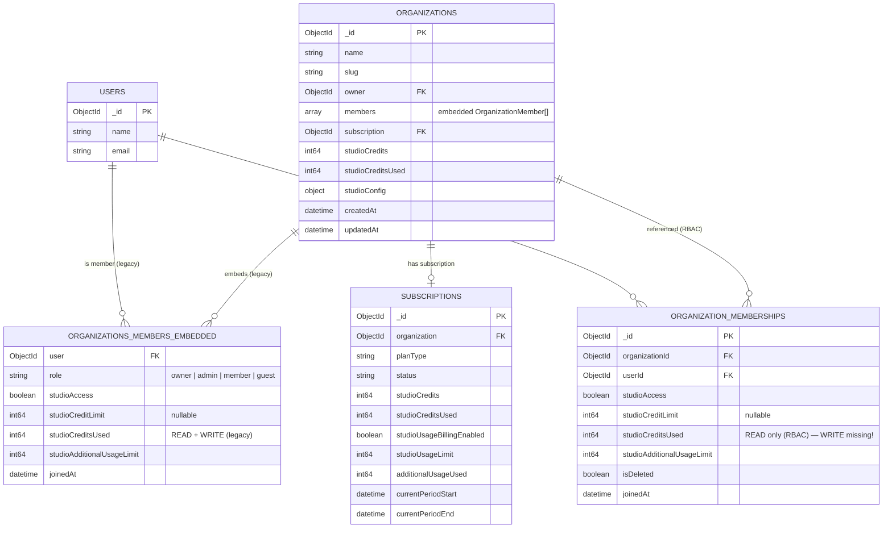
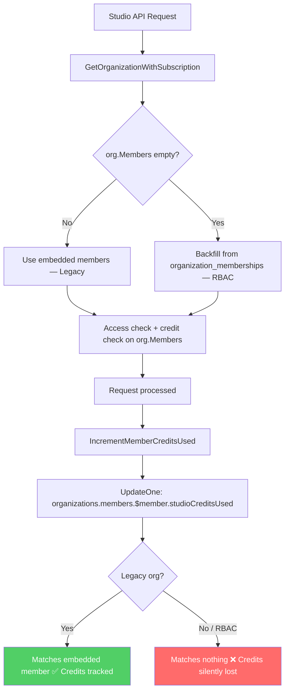
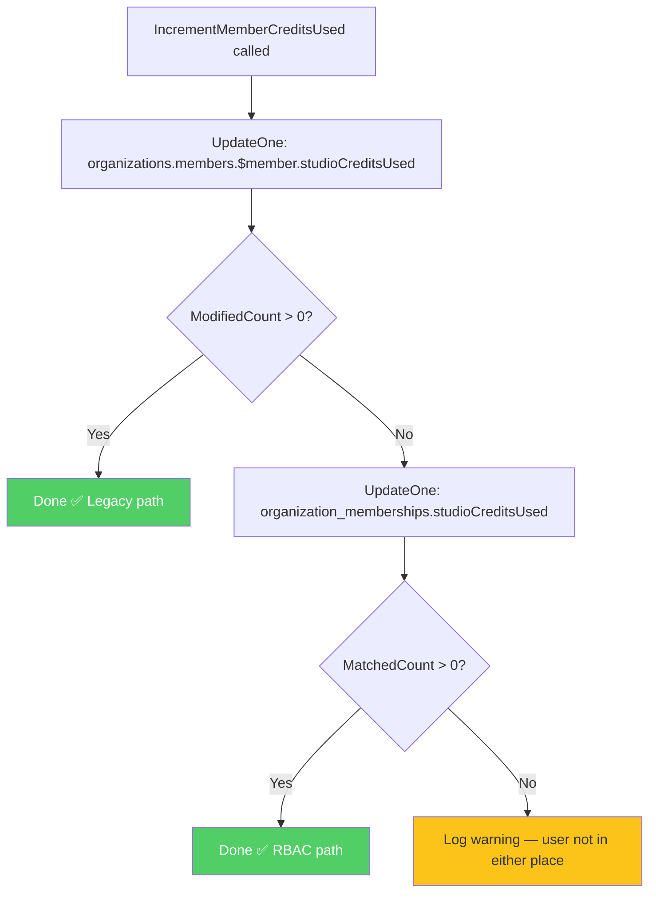
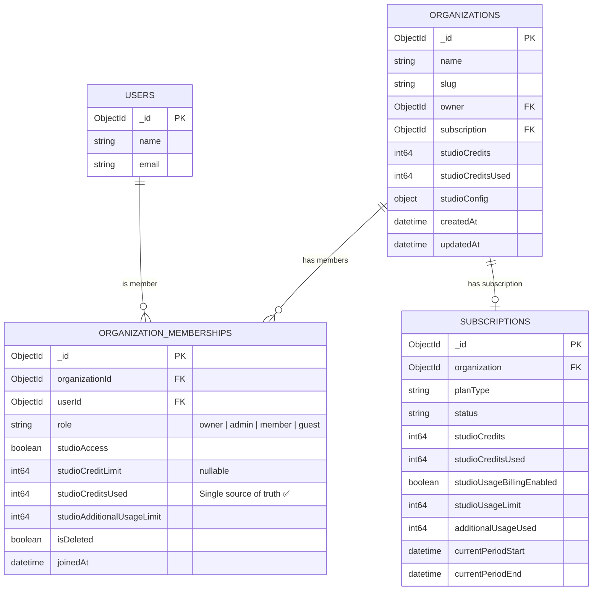

# Implementation Plan: Fix Credits Write Inconsistency

**Branch:** `fix/studio-credits-write-organization-memberships`  
**Created from:** `feature/free-credit-mode-fix-studio-access-rbac`  
**Date:** 2026-03-16

---

## Problem Statement

Gateway reads and writes use different sources of truth for RBAC orgs:

| Operation | Legacy Org | RBAC Org (empty embedded members) |
|-----------|-----------|-----------------------------------|
| **Read** members | `organizations.members` | `organization_memberships` (PR #48 backfill) |
| **Write** credit usage | `organizations.members.$[member].studioCreditsUsed` | Same embedded array → **empty** → update matches nothing → **credits silently lost** |

For RBAC orgs, Studio access works (members are backfilled from `organization_memberships` on read), but credit usage writes target a non-existent embedded array element and are silently dropped.

---

## ER Diagram — Current State

### The inconsistency

---

## Solution: Option A — Try Embedded, Fall Back to Memberships (Recommended)

### Why Option A

- No extra read query needed
- Uses MongoDB `UpdateResult.ModifiedCount` to detect if embedded update hit anything
- Zero overhead for legacy orgs
- No race condition (checks write result, not a separate read)

### Scope

**One function to change:** `IncrementMemberCreditsUsed` in `gateway/internal/repository/mongo.go`

**Two callers (unchanged):**
- `gateway/internal/middleware/billing.go` — called async in goroutine; errors logged
- `gateway/internal/handlers/studio.go` — called sync; errors return 500

### Implementation Steps

1. **Keep existing embedded update** — run `UpdateOne` on `organizations.members.$[member].studioCreditsUsed`
2. **Capture `UpdateResult`** (currently discarded with `_`)
3. **Check `result.ModifiedCount`**:
   - `> 0` → embedded member found → done (legacy path)
   - `== 0` → no embedded member → run RBAC fallback
4. **RBAC fallback:** `UpdateOne` on `organization_memberships`:
   - Filter: `{ organizationId, userId, isDeleted: { $ne: true } }`
   - Update: `{ $inc: { studioCreditsUsed: amount } }`
5. **If RBAC also matches 0** → log warning, return nil (best-effort)

### Behavior Matrix After Fix

| Scenario | Embedded Update | Memberships Update | Credits Tracked? |
|----------|-----------------|--------------------|-----------------|
| Legacy org (members in embedded) | Matches, increments | Skipped | ✅ Yes |
| RBAC org (empty embedded) | Matches 0 | Matches, increments | ✅ Yes |
| User not found anywhere | Matches 0 | Matches 0 | ⚠️ No (logged) |

### Flow After Fix

---

## Alternative: Option B — Projected Read First

Read `organizations` with projection `{ members: { $slice: 1 } }` to check if embedded members exist, then write to only one target.

| | Option A (try + fallback) | Option B (read first) |
|---|---|---|
| Extra query for legacy orgs | None | 1 read every time |
| Extra query for RBAC orgs | 1 write (memberships) | 1 read + 1 write |
| Race condition | None | Small window |
| Code complexity | Low | Medium |

**Verdict:** Option A is better for the immediate fix.

---

## Future: Full Cutoff of Embedded `org.Members`

### What It Means

- Stop reading from embedded `organization.members` entirely
- Always read members from `organization_memberships`
- Always write credit usage to `organization_memberships`
- `Organization.Members` in Go struct becomes transient/computed field

### Prerequisites

1. **Migration script** — copy all legacy embedded `organization.members` → `organization_memberships`
2. **NitroCloud alignment** — confirm NitroCloud web app no longer writes to embedded members
3. **Index** — ensure `organization_memberships` has index on `{ organizationId: 1, isDeleted: 1 }`
4. **Verification** — query to confirm all orgs have matching membership documents

### ER Diagram — After Full Cutoff

### Pros of Full Cutoff

- Single source of truth — zero inconsistency
- Aligns with NitroCloud RBAC model
- Simpler code — one read/write path
- Future-proof for new member-level features

### Risks of Full Cutoff

| Risk | Mitigation |
|------|------------|
| Legacy orgs break if not migrated | One-time migration script before deploy |
| NitroCloud web app still uses embedded members | Coordinate with NitroCloud team |
| Rollback loses new credit writes | Shadow-write period or keep embedded field on model |
| Extra DB call on every org load | Index on `{ organizationId: 1, isDeleted: 1 }` |

---

## Recommended Execution Order

| Phase | What | When |
|-------|------|------|
| **Phase 1** | Ship Option A (try embedded, fall back to memberships) | Now — this branch |
| **Phase 2** | Migration script for legacy orgs | Next sprint |
| **Phase 3** | Full cutoff of embedded `org.Members` | After migration verified |

---

## Files to Change (Phase 1 — Option A)

| File | Change |
|------|--------|
| `gateway/internal/repository/mongo.go` | Modify `IncrementMemberCreditsUsed`: capture `UpdateResult`, add RBAC fallback to `organization_memberships` |

No changes to: `collections.go`, `billing.go`, `studio.go`, `models/organization.go`

---

## Testing Checklist

- [ ] Legacy org: Studio request → `organizations.members[].studioCreditsUsed` incremented
- [ ] RBAC org: Studio request → `organization_memberships.studioCreditsUsed` incremented, embedded stays empty
- [ ] Missing user: Call with unknown userID → warning logged, no crash
- [ ] Owner: No member credit increment attempted (existing behavior preserved)
- [ ] Billing middleware (async): Errors logged, request not blocked
- [ ] Studio handler (sync): Error returns 500 correctly
