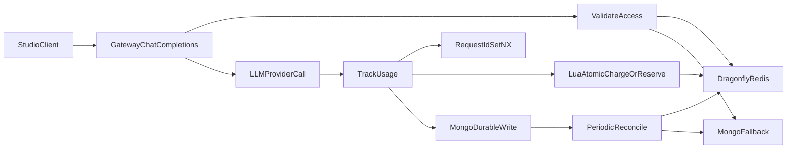

# Implement Dragonfly/Redis for Chat + Credits

## Goal

Use Dragonfly (Redis-compatible) as the primary in-memory layer to:

- Reduce chat request latency from repeated Mongo reads in access checks.
- Make credit updates safer under concurrency via atomic/idempotent write paths.
- Keep Mongo as durable source during migration, then progressively shift read pressure to Dragonfly.

## Current Hot Path (from code)

- Studio sends chat via `[/Users/baki/Desktop/wekan/nitrostudio/studio/lib/api.ts](/Users/baki/Desktop/wekan/nitrostudio/studio/lib/api.ts)` into gateway `/v1/chat/completions`.
- Gateway middleware chain in `[/Users/baki/Desktop/wekan/nitrostudio/gateway/cmd/server/main.go](/Users/baki/Desktop/wekan/nitrostudio/gateway/cmd/server/main.go)`: `Authenticate -> ValidateAccess -> RateLimit -> LogRequest -> TrackUsage -> ChatCompletions`.
- Heavy DB reads in `[/Users/baki/Desktop/wekan/nitrostudio/gateway/internal/middleware/studio_access.go](/Users/baki/Desktop/wekan/nitrostudio/gateway/internal/middleware/studio_access.go)` and `[/Users/baki/Desktop/wekan/nitrostudio/gateway/internal/repository/mongo.go](/Users/baki/Desktop/wekan/nitrostudio/gateway/internal/repository/mongo.go)` (`GetStudioUsageStatus`).
- Credit updates happen in billing middleware `[/Users/baki/Desktop/wekan/nitrostudio/gateway/internal/middleware/billing.go](/Users/baki/Desktop/wekan/nitrostudio/gateway/internal/middleware/billing.go)`, currently with async update risk.

## Current Architecture

```mermaid
flowchart LR
  studioClient[StudioClient] --> gatewayChat[GatewayChatCompletions]
  gatewayChat --> authn[Authenticate]
  authn --> accessCheck[ValidateAccessMongo]
  accessCheck --> rateLimit[RateLimit]
  rateLimit --> requestLog[LogRequest]
  requestLog --> usageTrack[TrackUsage]
  usageTrack --> providerCall[LLMProviderCall]
  providerCall --> asyncCredit[AsyncCreditUpdate]
  asyncCredit --> mongoWrite[MongoUsageAndCredits]
```

## Target Architecture

## Cache + Atomic Key Design

- Access snapshot: `gw:studio-access:{orgId}:{userId}` (TTL `15-30s`)
- Org/subscription snapshot: `gw:orgsub:{orgId}` (TTL `30s`)
- Usage status: `gw:usage-status:{orgId}:{userId}:{yyyyMM}` (TTL `10s`, invalidate on charge)
- Idempotency: `gw:usage:req:{requestId}` via `SETNX` (TTL `24h`)
- Credits counters:
  - `gw:credits:org:{orgId}:used`
  - `gw:credits:member:{orgId}:{userId}:used`
  - optional overage buckets as separate keys
- Optional model catalog cache: `gw:openrouter:models:user` (TTL `300s`)

## Phased Rollout

1. Add Dragonfly client + health checks + feature flags.
2. Add read-through caches for access/usage checks in `ValidateAccess` path.
3. Add idempotency guard (`requestId`) in billing path to stop duplicate charging.
4. Add atomic Lua charge/reserve script for write path (balanced mode: atomic charge path, eventual report aggregation).
5. Keep Mongo writes as durable source; dual-write counters to Dragonfly; compare divergences.
6. Add reconciliation job to repair drift and keep counters aligned.
7. Shift reads to Dragonfly-first with Mongo fallback; keep kill-switch.
8. Tune TTLs and invalidate keys on member/subscription/model policy updates.

## File-Level Implementation Map

- Config + flags:
  - `[/Users/baki/Desktop/wekan/nitrostudio/gateway/internal/config/config.go](/Users/baki/Desktop/wekan/nitrostudio/gateway/internal/config/config.go)`
- New cache layer (adapter + scripts):
  - `gateway/internal/cache/redis_client.go`
  - `gateway/internal/cache/keys.go`
  - `gateway/internal/cache/scripts.lua` (atomic charge/check)
- Middleware integration:
  - `[/Users/baki/Desktop/wekan/nitrostudio/gateway/internal/middleware/studio_access.go](/Users/baki/Desktop/wekan/nitrostudio/gateway/internal/middleware/studio_access.go)`
  - `[/Users/baki/Desktop/wekan/nitrostudio/gateway/internal/middleware/billing.go](/Users/baki/Desktop/wekan/nitrostudio/gateway/internal/middleware/billing.go)`
  - `[/Users/baki/Desktop/wekan/nitrostudio/gateway/cmd/server/main.go](/Users/baki/Desktop/wekan/nitrostudio/gateway/cmd/server/main.go)`
- Repository invalidation hooks:
  - `[/Users/baki/Desktop/wekan/nitrostudio/gateway/internal/repository/mongo.go](/Users/baki/Desktop/wekan/nitrostudio/gateway/internal/repository/mongo.go)`
- Infrastructure:
  - `[/Users/baki/Desktop/wekan/nitrostudio/gateway/docker-compose.yml](/Users/baki/Desktop/wekan/nitrostudio/gateway/docker-compose.yml)` (Dragonfly service + env)

## Verification Strategy

- Correctness:
  - No duplicate charge for same `requestId`.
  - Credit limits enforced under concurrent requests.
  - Mongo and Dragonfly counters remain within acceptable drift window.
- Performance:
  - Reduced p50/p95 latency for `/v1/chat/completions` pre-provider phase.
  - Reduced Mongo query volume for access/status reads.
- Safety:
  - Feature flags allow immediate fallback to Mongo-only behavior.

