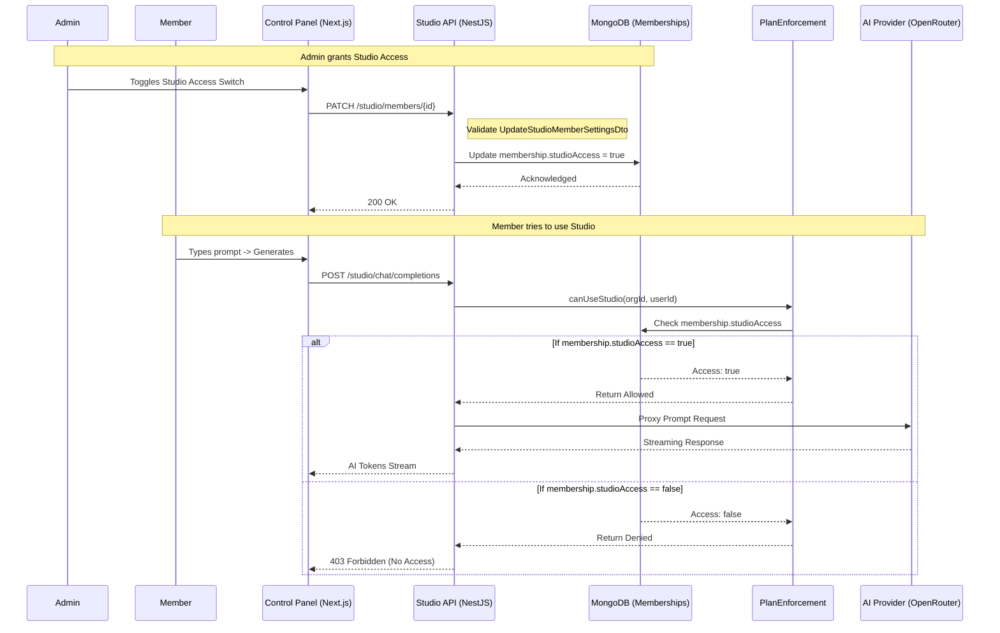

# Studio Management Flow: Member Permissions

This document outlines the entire architectural flow, active paths, and service interactions specifically surrounding the **Studio Access (Member Permissions)** inside the `home/settings/[id]/studio` page.

## 1. The Frontend Layer

### Path & View
**File**: [frontend/app/home/settings/[id]/studio/page.tsx](file:///Users/baki/Desktop/wekan/nitrocloud/frontend/app/home/settings/%5Bid%5D/studio/page.tsx)
**UI**: Displays the Organization's members in a table with a **Studio Access** toggle switch, a Credit Limit input, and an Additional Usage input.

### User Interaction Flow
1. **Load Data**: The component uses `organizationsApi.getMembers(organizationId)` and `studioApi.getOrganizationUsage(organizationId)` to build a list of members securely merged with their active model usage costs.
2. **Action**: An Admin clicks the "Studio Access" switch for a specific user.
3. **API Call**: The UI triggers `handleToggleAccess(memberId, enabled)` which calls the backend via `studioApi.updateMemberSettings(orgId, memberId, { studioAccess: enabled })`.

---

## 2. The Backend Layer

### Path & Payloads
**DTO**: [backend/src/studio/dto/studio-management.dto.ts](file:///Users/baki/Desktop/wekan/nitrocloud/backend/src/studio/dto/studio-management.dto.ts)
The incoming request body is validated against the [UpdateStudioMemberSettingsDto](file:///Users/baki/Desktop/wekan/nitrocloud/backend/src/studio/dto/studio-management.dto.ts#3-19), ensuring the `studioAccess` payload is strictly a boolean.

### Storage & Schema
**Schema**: `OrganizationMembership` ([backend/src/rbac/schemas/organization-membership.schema.ts](file:///Users/baki/Desktop/wekan/nitrocloud/backend/src/rbac/schemas/organization-membership.schema.ts))
The `studioAccess` permission is **not** a global user setting; it is tightly coupled to the user's explicit relation to the Organization. When the setting is updated, MongoDB writes the boolean value into the `OrganizationMembership` document.

### Viewing Members (Fetching the Data)
**Service**: `RbacService.getOrganizationMembersForAdmin` ([backend/src/rbac/rbac.service.ts](file:///Users/baki/Desktop/wekan/nitrocloud/backend/src/rbac/rbac.service.ts))
When the frontend asks for the list of members to populate the settings page, this backend service queries `organization_memberships`. 
*Note: Organization Owners are hardcoded to have `studioAccess: true` regardless of the explicit boolean recorded in the database.*

---

## 3. Enforcement Layer (How the Permission is Used)

Merely flipping the switch to `true` or `false` controls the data state, but the actual security enforcement happens at the prompt gateway.

**Service**: `PlanEnforcementService.canUseStudio(organizationId, userId)` ([backend/src/billing/services/plan-enforcement.service.ts](file:///Users/baki/Desktop/wekan/nitrocloud/backend/src/billing/services/plan-enforcement.service.ts))

Whenever a user attempts to generate AI text using the Studio, the backend executes [canUseStudio](file:///Users/baki/Desktop/wekan/nitrocloud/backend/src/billing/services/plan-enforcement.service.ts#328-424):
1. It queries the `OrganizationMembership` database.
2. If the user is the **Owner**, they are granted an automatic pass.
3. If the user is a normal member, it strictly checks if `membership.studioAccess` is `true`.
4. If it is `false` or the record is missing, it instantly hard-rejects the request with: *"You do not have Studio access for this organization."*

---

## 4. Architectural Diagram

