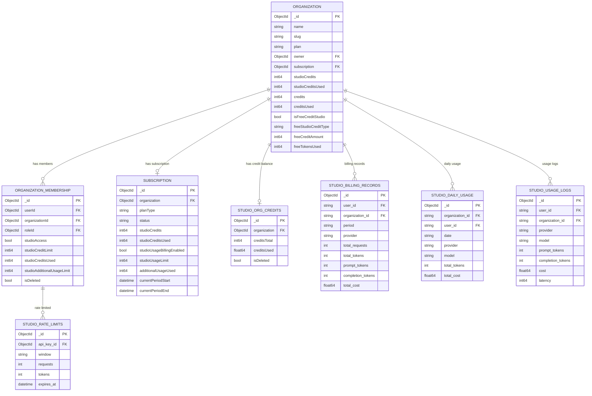
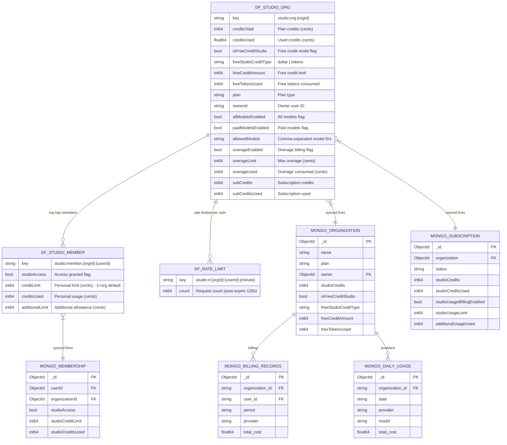

# Dragonfly Implementation Plan — NitroStudio Gateway

> **Status**: Draft  
> **Date**: 2026-03-18  
> **Scope**: NitroStudio Gateway (`gateway/`)  
> **Goal**: Move all hot-path credit enforcement, membership checks, and rate limiting from MongoDB to Dragonfly to reduce per-request latency from ~30-50ms to ~2-4ms.

---

## Table of Contents

1. [Problem Statement](#1-problem-statement)
2. [Architecture Overview](#2-architecture-overview)
3. [Entity Relationship Diagrams](#3-entity-relationship-diagrams)
4. [Dragonfly Key Schema](#4-dragonfly-key-schema)
5. [Data Flow — Before vs After](#5-data-flow--before-vs-after)
6. [Implementation Phases](#6-implementation-phases)
7. [Sync Strategy — MongoDB ↔ Dragonfly](#7-sync-strategy--mongodb--dragonfly)
8. [Lua Scripts for Atomic Operations](#8-lua-scripts-for-atomic-operations)
9. [Gateway Code Changes](#9-gateway-code-changes)
10. [Configuration](#10-configuration)
11. [Failure Modes & Fallbacks](#11-failure-modes--fallbacks)
12. [Migration Plan](#12-migration-plan)
13. [Observability](#13-observability)

---

## 1. Problem Statement

Every `/v1/chat/completions` request through the gateway currently triggers **7-12 MongoDB round-trips**:

| Step | Middleware | MongoDB Operations | Latency |
|------|-----------|-------------------|---------|
| 1 | `AuthMiddleware` | JWT parse (no DB) | ~0ms |
| 2 | `StudioAccessMiddleware` | `GetOrganizationWithSubscription` (2 queries) | ~5-10ms |
| 3 | `StudioAccessMiddleware` | `GetOrganizationMembership` (1 query) | ~3-5ms |
| 4 | `StudioAccessMiddleware` | `GetStudioUsageStatus` (2 queries + aggregation) | ~10-20ms |
| 5 | `RateLimitMiddleware` | `GetRateLimitEntry` (1 query) | ~3-5ms |
| 6 | `BillingMiddleware` (post) | `IncrementMemberCreditsUsed` (1 write) | ~3-5ms |
| 7 | `BillingMiddleware` (post) | `IncrementSubscriptionCreditsUsed` (1 write) | ~3-5ms |
| 8 | `BillingMiddleware` (post) | `IncrementOrgFreeTokensUsed` (1 write) | ~3-5ms |
| 9 | `UsageWorker` (async) | `UpdateBillingRecord` + `UpdateDailyUsage` + `CreateUsageLog` (3 writes) | async |
| | **Total pre-request** | **5-7 queries** | **~25-45ms** |
| | **Total post-request (sync)** | **2-3 writes** | **~6-15ms** |

**Target**: Reduce pre-request latency to **~1-3ms** (2-3 Dragonfly calls) and post-request sync writes to **~0.5-1ms** (Dragonfly HINCRBY).

---

## 2. Architecture Overview

```
┌─────────────────────────────────────────────────────────────────────────────┐
│                           REQUEST FLOW                                      │
│                                                                             │
│  Studio Client                                                              │
│       │                                                                     │
│       ▼                                                                     │
│  ┌─────────┐     ┌──────────────────┐     ┌──────────────────┐              │
│  │  Auth    │────▶│  StudioAccess    │────▶│   RateLimit      │──────┐      │
│  │Middleware│     │  Middleware       │     │   Middleware      │      │      │
│  └─────────┘     │  (Dragonfly)     │     │   (Dragonfly)    │      │      │
│                  └──────────────────┘     └──────────────────┘      │      │
│                                                                      │      │
│                           ┌──────────────────────┐                   │      │
│                           │   Chat Completions   │◀──────────────────┘      │
│                           │   Handler (proxy)    │                          │
│                           └──────────┬───────────┘                          │
│                                      │                                      │
│                                      ▼                                      │
│                           ┌──────────────────────┐                          │
│                           │  Billing Middleware   │                          │
│                           │  (Dragonfly HINCRBY)  │                          │
│                           └──────────┬───────────┘                          │
│                                      │                                      │
│                              ┌───────┴───────┐                              │
│                              │  UsageWorker  │ (async channel)              │
│                              └───────┬───────┘                              │
│                                      │                                      │
│                        ┌─────────────┼─────────────┐                        │
│                        ▼             ▼             ▼                        │
│                   ┌─────────┐  ┌──────────┐  ┌───────────┐                  │
│                   │ MongoDB │  │ClickHouse│  │ Dragonfly │                  │
│                   │ (cold)  │  │(analytics)│  │ reconcile │                  │
│                   └─────────┘  └──────────┘  └───────────┘                  │
└─────────────────────────────────────────────────────────────────────────────┘
```

### Component Roles

| Component | Role | Data Lifetime |
|-----------|------|---------------|
| **Dragonfly** | Real-time credit enforcement, rate limiting, membership checks | Hot — seconds to hours |
| **MongoDB** | Durable source of truth for orgs, subscriptions, billing records | Cold — permanent |
| **ClickHouse** | Analytics, usage logs, daily aggregates | Analytical — permanent |

---

## 3. Entity Relationship Diagrams

### 3.1 Current State — MongoDB Only

All data lives in MongoDB. Every middleware step queries MongoDB directly.



### 3.2 Target State — Dragonfly + MongoDB

Hot-path data moves to Dragonfly hashes. MongoDB retains durable billing/analytics data.



### 3.3 Sync Flow Diagram

```mermaid
flowchart TB
    subgraph NitroCloud_Backend["NitroCloud Backend (NestJS)"]
        A[Org Created / Updated]
        B[Subscription Changed]
        C[Member Added / Updated]
        D[Credit Top-Up]
        E[Plan Change]
        F[Billing Period Reset]
    end

    subgraph Dragonfly["Dragonfly (Hot Store)"]
        G["studio:org:{orgId}"]
        H["studio:member:{orgId}:{userId}"]
        I["studio:rl:{orgId}:{userId}:{min}"]
    end

    subgraph Gateway["NitroStudio Gateway (Go)"]
        J[StudioAccess Middleware]
        K[RateLimit Middleware]
        L[Billing Middleware]
        M[Reconciliation Cron]
    end

    subgraph MongoDB["MongoDB (Cold Store)"]
        N[organizations]
        O[subscriptions]
        P[organization_memberships]
        Q[studio_billing_records]
        R[studio_daily_usage]
    end

    A -->|HSET| G
    B -->|HSET| G
    C -->|HSET| H
    D -->|HSET| G
    E -->|HSET| G
    F -->|HSET reset counters| G
    F -->|HSET reset counters| H

    J -->|HGETALL| G
    J -->|HGETALL| H
    K -->|INCR + EXPIRE| I
    L -->|HINCRBY| G
    L -->|HINCRBY| H

    L -->|async| Q
    L -->|async| R

    M -->|read counters| G
    M -->|reconcile| N
    M -->|reconcile| O
    M -->|reconcile| P
```



---

## 4. Dragonfly Key Schema

### 4.1 Organization State — `studio:org:{orgId}`

A Redis Hash containing all org-level credit and config state needed by the middleware.

| Hash Field | Type | Source | Description |
|------------|------|--------|-------------|
| `creditsTotal` | int64 | `studio_org_credits.creditsTotal` or `subscription.studioCredits` | Plan credit balance in cents |
| `creditsUsed` | int64 | Incremented by gateway, reconciled from `studio_billing_records` | Credits consumed in cents (stored as int, represents hundredths of cent for precision) |
| `isFreeCreditStudio` | 0/1 | `organization.isFreeCreditStudio` | Free credit mode |
| `freeStudioCreditType` | string | `organization.freeStudioCreditType` | `"dollar"` or `"tokens"` |
| `freeCreditAmount` | int64 | `organization.freeCreditAmount` | Free credit limit (tokens or cents) |
| `freeTokensUsed` | int64 | Incremented by gateway | Free tokens consumed |
| `plan` | string | `organization.plan` | Plan type (FREE, PRO, etc.) |
| `ownerId` | string | `organization.owner` | Owner ObjectId hex string |
| `allModelsEnabled` | 0/1 | `organization.studioConfig.allModelsEnabled` | All models allowed |
| `paidModelsEnabled` | 0/1 | `organization.studioConfig.paidModelsEnabled` | Paid models allowed |
| `allowedModels` | string | `organization.studioConfig.allowedModels` | Comma-separated model IDs |
| `overageEnabled` | 0/1 | `subscription.studioUsageBillingEnabled` | Overage billing |
| `overageLimit` | int64 | `subscription.studioUsageLimit` | Max overage in cents |
| `overageUsed` | int64 | `subscription.additionalUsageUsed` | Overage consumed in cents |
| `subCredits` | int64 | `subscription.studioCredits` | Subscription base credits |
| `subCreditsUsed` | int64 | `subscription.studioCreditsUsed` | Subscription credits used |
| `version` | int64 | Monotonic counter | Optimistic concurrency control |

**TTL**: None (managed explicitly). Orphaned keys cleaned by reconciliation cron.

**Example**:
```
HSET studio:org:6601a2b3c4d5e6f7a8b9c0d1 \
  creditsTotal 5000 \
  creditsUsed 1234 \
  isFreeCreditStudio 0 \
  freeStudioCreditType "" \
  freeCreditAmount 0 \
  freeTokensUsed 0 \
  plan PRO \
  ownerId 6601a2b3c4d5e6f7a8b9c0d2 \
  allModelsEnabled 1 \
  paidModelsEnabled 1 \
  allowedModels "" \
  overageEnabled 1 \
  overageLimit 10000 \
  overageUsed 0 \
  subCredits 5000 \
  subCreditsUsed 1234 \
  version 1
```

### 4.2 Member State — `studio:member:{orgId}:{userId}`

A Redis Hash per member containing access control and personal credit limits.

| Hash Field | Type | Source | Description |
|------------|------|--------|-------------|
| `studioAccess` | 0/1 | `organization_memberships.studioAccess` | Access granted |
| `creditLimit` | int64 | `organization_memberships.studioCreditLimit` | Personal limit in cents. `-1` = use org default |
| `creditsUsed` | int64 | Incremented by gateway | Personal credits consumed |
| `additionalLimit` | int64 | `organization_memberships.studioAdditionalUsageLimit` | Additional allowance in cents |
| `version` | int64 | Monotonic counter | Optimistic concurrency control |

**TTL**: None (managed explicitly).

**Example**:
```
HSET studio:member:6601a2b3c4d5e6f7a8b9c0d1:6601a2b3c4d5e6f7a8b9c0d2 \
  studioAccess 1 \
  creditLimit 5000 \
  creditsUsed 320 \
  additionalLimit 0 \
  version 1
```

### 4.3 Rate Limit — `studio:rl:{orgId}:{userId}:{minute}`

A simple string counter with auto-expire.

| Key | Type | TTL | Description |
|-----|------|-----|-------------|
| `studio:rl:{orgId}:{userId}:2026-03-18T14:30` | int64 | 120s | Request count this minute |

**Operations**: `INCR` + `EXPIRE 120` (set-if-not-exists via Lua).

---

## 5. Data Flow — Before vs After

### 5.1 Before (Current — All MongoDB)

```
Client Request
  │
  ├─▶ [Auth] JWT parse (no DB)
  │
  ├─▶ [StudioAccess]
  │     ├─ MongoDB: FindOne(organizations, {_id: orgId})           ~3-5ms
  │     ├─ MongoDB: FindOne(subscriptions, {org: orgId})           ~3-5ms
  │     ├─ MongoDB: FindOne(organization_memberships, {org,user})  ~3-5ms
  │     ├─ MongoDB: FindOne(organizations, {_id: orgId})  (again)  ~3-5ms
  │     ├─ MongoDB: FindOne(subscriptions, {org: orgId})  (again)  ~3-5ms
  │     └─ MongoDB: Aggregate(studio_billing_records, pipeline)    ~5-10ms
  │
  ├─▶ [RateLimit]
  │     └─ MongoDB: FindOne(studio_rate_limits, {key,window})      ~3-5ms
  │
  ├─▶ [Chat Handler] ──▶ OpenRouter/Gemini/OpenAI
  │
  ├─▶ [Billing] (sync)
  │     ├─ MongoDB: UpdateOne(organization_memberships, $inc)      ~3-5ms
  │     ├─ MongoDB: UpdateOne(subscriptions, $inc)                 ~3-5ms
  │     └─ MongoDB: UpdateOne(organizations, $inc freeTokensUsed)  ~3-5ms
  │
  └─▶ [UsageWorker] (async channel)
        ├─ MongoDB: UpdateOne(studio_billing_records, $inc)
        ├─ MongoDB: UpdateOne(studio_daily_usage, $inc)
        └─ MongoDB: InsertOne(studio_usage_logs)
        └─ ClickHouse: BatchInsert(usage_logs)

TOTAL PRE-REQUEST:  ~25-40ms  (5-7 MongoDB queries)
TOTAL POST-REQUEST: ~9-15ms   (2-3 sync MongoDB writes)
```

### 5.2 After (Dragonfly Hot Path)

```
Client Request
  │
  ├─▶ [Auth] JWT parse (no DB)
  │
  ├─▶ [StudioAccess]
  │     ├─ Dragonfly: HGETALL studio:org:{orgId}                  ~0.3ms
  │     └─ Dragonfly: HGETALL studio:member:{orgId}:{userId}      ~0.3ms
  │
  ├─▶ [RateLimit]
  │     └─ Dragonfly: EVAL rate_limit_lua (INCR+EXPIRE)           ~0.3ms
  │
  ├─▶ [Chat Handler] ──▶ OpenRouter/Gemini/OpenAI
  │
  ├─▶ [Billing] (sync Dragonfly, async MongoDB)
  │     ├─ Dragonfly: EVAL credit_increment_lua (atomic HINCRBY)  ~0.3ms
  │     └─ (async) MongoDB writes via UsageWorker channel
  │
  └─▶ [UsageWorker] (async channel — unchanged)
        ├─ MongoDB: UpdateOne(studio_billing_records, $inc)
        ├─ MongoDB: UpdateOne(studio_daily_usage, $inc)
        ├─ MongoDB: InsertOne(studio_usage_logs)
        ├─ MongoDB: UpdateOne(subscriptions, $inc)          ◀── moved here
        ├─ MongoDB: UpdateOne(memberships, $inc)            ◀── moved here
        └─ ClickHouse: BatchInsert(usage_logs)

TOTAL PRE-REQUEST:  ~1-2ms    (2 Dragonfly HGETALL)
TOTAL POST-REQUEST: ~0.3-1ms  (1 Dragonfly Lua script)
ASYNC:              unchanged  (MongoDB + ClickHouse via worker)
```

**Latency reduction: ~93% on the hot path.**

---

## 6. Implementation Phases

### Phase 1: Dragonfly Client & Org State (Week 1)

**Goal**: Add Dragonfly client to gateway. Seed org state from MongoDB on startup. Read org state from Dragonfly in `StudioAccessMiddleware`.

#### Tasks

1. **Add `rueidis` dependency** to `go.mod`
2. **Create `internal/store/dragonfly.go`** — Dragonfly client wrapper
   - Connect with `DRAGONFLY_ADDR`, `DRAGONFLY_PASSWORD`, `DRAGONFLY_TLS`
   - `GetOrgState(orgId) -> OrgState` (HGETALL)
   - `SetOrgState(orgId, OrgState)` (HSET)
   - `IncrOrgCreditsUsed(orgId, amount)` (HINCRBY)
   - `IncrOrgFreeTokensUsed(orgId, amount)` (HINCRBY)
   - `IncrOrgOverageUsed(orgId, amount)` (HINCRBY)
3. **Create `internal/store/types.go`** — Go structs for Dragonfly state
4. **Create `internal/store/seed.go`** — Startup seeder
   - Iterate all orgs with active subscriptions in MongoDB
   - Populate `studio:org:{orgId}` hashes
5. **Update `StudioAccessMiddleware`** — Read from Dragonfly first, fallback to MongoDB
6. **Update `cmd/server/main.go`** — Initialize Dragonfly store, run seeder

#### Files Changed

| File | Change |
|------|--------|
| `go.mod` | Add `github.com/redis/rueidis` |
| `internal/store/dragonfly.go` | New — Dragonfly client |
| `internal/store/types.go` | New — OrgState, MemberState structs |
| `internal/store/seed.go` | New — Startup seeder |
| `internal/config/config.go` | Add `DragonflyAddr`, `DragonflyPassword`, `DragonflyTLS` |
| `internal/middleware/studio_access.go` | Read from Dragonfly store |
| `cmd/server/main.go` | Init Dragonfly, run seeder |

### Phase 2: Member State & Rate Limiting (Week 2)

**Goal**: Move member access checks and rate limiting from MongoDB to Dragonfly.

#### Tasks

1. **Add member state methods to `dragonfly.go`**
   - `GetMemberState(orgId, userId) -> MemberState`
   - `SetMemberState(orgId, userId, MemberState)`
   - `IncrMemberCreditsUsed(orgId, userId, amount)`
2. **Seed members** in `seed.go` — Iterate `organization_memberships` collection
3. **Update `StudioAccessMiddleware`** — Member checks from Dragonfly
4. **Create rate limit Lua script** — Atomic INCR + EXPIRE
5. **Update `RateLimitMiddleware`** — Use Dragonfly instead of MongoDB `studio_rate_limits`
6. **Remove MongoDB rate limit dependency** from middleware

#### Files Changed

| File | Change |
|------|--------|
| `internal/store/dragonfly.go` | Add member methods, rate limit Lua |
| `internal/store/seed.go` | Seed member state |
| `internal/middleware/studio_access.go` | Member checks from Dragonfly |
| `internal/middleware/ratelimit.go` | Rewrite to use Dragonfly |

### Phase 3: Billing Credit Writes (Week 3)

**Goal**: Move synchronous credit increment writes from MongoDB to Dragonfly. Push MongoDB writes to the async UsageWorker.

#### Tasks

1. **Create credit increment Lua scripts** (see [Section 8](#8-lua-scripts-for-atomic-operations))
   - Dollar mode: atomic check-and-increment for org + member
   - Token mode: atomic check-and-increment for free tokens
2. **Update `BillingMiddleware`** — Sync writes to Dragonfly, async to UsageWorker
3. **Extend `UsageWorker`** — Also persist member and subscription credit increments to MongoDB
4. **Remove sync MongoDB writes** from `BillingMiddleware`

#### Files Changed

| File | Change |
|------|--------|
| `internal/store/dragonfly.go` | Add Lua scripts for credit operations |
| `internal/middleware/billing.go` | Rewrite — Dragonfly sync, MongoDB async |
| `internal/repository/worker.go` | Add member/subscription credit persistence |

### Phase 4: Reconciliation & Cleanup (Week 4)

**Goal**: Add periodic reconciliation cron, webhook-driven updates, and cleanup for orphaned keys.

#### Tasks

1. **Create `internal/store/reconcile.go`** — Periodic job
   - Read Dragonfly counters → compare with MongoDB aggregated billing records
   - Fix drift (Dragonfly counter diverged from MongoDB)
   - Remove orphaned keys (deleted orgs/members)
2. **Create webhook/event handler** for NitroCloud backend events:
   - Org created → seed org state
   - Subscription changed → update org state
   - Member added/updated/removed → update/delete member state
   - Credit top-up → update creditsTotal
   - Billing period reset → reset counters
3. **Add health check** — Dragonfly ping in `/health` endpoint
4. **Add Prometheus metrics** — Dragonfly hit/miss rates, latency

#### Files Changed

| File | Change |
|------|--------|
| `internal/store/reconcile.go` | New — Reconciliation cron |
| `internal/handlers/webhooks.go` | New — Event handlers for org/member/sub changes |
| `internal/handlers/health.go` | Add Dragonfly health check |
| `cmd/server/main.go` | Register webhook routes, start reconciliation cron |

---

## 7. Sync Strategy — MongoDB ↔ Dragonfly

### 7.1 Write Paths

| Event | Who Writes to Dragonfly | Trigger |
|-------|------------------------|---------|
| Org created | NitroCloud backend (webhook → gateway) | Org creation API |
| Subscription changed | NitroCloud backend (webhook → gateway) | Stripe webhook |
| Member added/updated | NitroCloud backend (webhook → gateway) | Member management API |
| Credit top-up | NitroCloud backend (webhook → gateway) | Admin/Stripe action |
| Plan change | NitroCloud backend (webhook → gateway) | Stripe webhook |
| Billing period reset | NitroCloud backend (webhook → gateway) | Stripe subscription renewal |
| Per-request credit usage | Gateway directly | Every chat completion |

### 7.2 Read Paths

| Reader | Source | Fallback |
|--------|--------|----------|
| Gateway (hot path) | Dragonfly | MongoDB (if key missing) |
| NitroCloud dashboard | MongoDB | — |
| Analytics | ClickHouse / MongoDB | — |

### 7.3 Conflict Resolution

- **Dragonfly is authoritative for real-time counters** (`creditsUsed`, `freeTokensUsed`, `overageUsed`, member `creditsUsed`)
- **MongoDB is authoritative for configuration** (`creditsTotal`, `plan`, `allowedModels`, limits)
- **Reconciliation cron** (every 5 minutes) detects and fixes drift:
  - If Dragonfly counter < MongoDB aggregated total → Dragonfly missed increments → correct upward
  - If Dragonfly counter > MongoDB aggregated total → MongoDB write lag → no action (eventual consistency)
  - If Dragonfly key missing → seed from MongoDB

### 7.4 Webhook Payload Format

The NitroCloud backend sends events to the gateway:

```json
POST /internal/events/org-updated
{
  "orgId": "6601a2b3c4d5e6f7a8b9c0d1",
  "event": "subscription_updated",
  "data": {
    "creditsTotal": 10000,
    "overageEnabled": true,
    "overageLimit": 5000
  }
}
```

```json
POST /internal/events/member-updated
{
  "orgId": "6601a2b3c4d5e6f7a8b9c0d1",
  "userId": "6601a2b3c4d5e6f7a8b9c0d2",
  "event": "member_updated",
  "data": {
    "studioAccess": true,
    "creditLimit": 5000
  }
}
```

---

## 8. Lua Scripts for Atomic Operations

### 8.1 Dollar Credit Check-and-Increment

Used after a chat completion to atomically increment credits with overflow protection.

```lua
-- KEYS[1] = studio:org:{orgId}
-- KEYS[2] = studio:member:{orgId}:{userId}   (empty string if owner)
-- ARGV[1] = cost in cents (integer)
-- ARGV[2] = "1" if owner, "0" if member
--
-- Returns:
--   1 = success (within plan credits)
--   2 = success (overage mode)
--  -1 = org credits exhausted (no overage)
--  -2 = org overage limit reached
--  -3 = member personal limit reached

local cost = tonumber(ARGV[1])
local isOwner = ARGV[2] == "1"

-- Read org state
local creditsTotal = tonumber(redis.call('HGET', KEYS[1], 'creditsTotal') or '0')
local creditsUsed = tonumber(redis.call('HGET', KEYS[1], 'creditsUsed') or '0')
local overageEnabled = redis.call('HGET', KEYS[1], 'overageEnabled') == '1'
local overageLimit = tonumber(redis.call('HGET', KEYS[1], 'overageLimit') or '0')
local overageUsed = tonumber(redis.call('HGET', KEYS[1], 'overageUsed') or '0')

-- Check member limit first (non-owner only)
if not isOwner and KEYS[2] ~= "" then
    local creditLimit = tonumber(redis.call('HGET', KEYS[2], 'creditLimit') or '-1')
    local memberUsed = tonumber(redis.call('HGET', KEYS[2], 'creditsUsed') or '0')
    local additionalLimit = tonumber(redis.call('HGET', KEYS[2], 'additionalLimit') or '0')
    if creditLimit >= 0 then
        local personalMax = creditLimit + additionalLimit
        if memberUsed + cost > personalMax then
            return -3
        end
    end
    -- Increment member usage
    redis.call('HINCRBY', KEYS[2], 'creditsUsed', cost)
end

-- Check org credits
local remaining = creditsTotal - creditsUsed
if remaining >= cost then
    -- Within plan credits
    redis.call('HINCRBY', KEYS[1], 'creditsUsed', cost)
    return 1
end

-- Plan credits exhausted — check overage
if not overageEnabled then
    return -1
end

if overageUsed + cost > overageLimit then
    return -2
end

-- Allow overage
redis.call('HINCRBY', KEYS[1], 'overageUsed', cost)
return 2
```

### 8.2 Token Credit Check-and-Increment (Free Token Mode)

```lua
-- KEYS[1] = studio:org:{orgId}
-- ARGV[1] = token count to add
--
-- Returns:
--  -1 = tokens exhausted
--  >0 = new total used (success)

local limit = tonumber(redis.call('HGET', KEYS[1], 'freeCreditAmount') or '0')
local used = tonumber(redis.call('HGET', KEYS[1], 'freeTokensUsed') or '0')

if limit <= 0 then return -2 end
if used >= limit then return -1 end

local newUsed = redis.call('HINCRBY', KEYS[1], 'freeTokensUsed', ARGV[1])
return newUsed
```

### 8.3 Rate Limit (Sliding Window per Minute)

```lua
-- KEYS[1] = studio:rl:{orgId}:{userId}:{minute}
-- ARGV[1] = max RPM
-- ARGV[2] = TTL seconds (120)
--
-- Returns:
--  -1 = rate limited
--  >0 = current count (allowed)

local current = redis.call('INCR', KEYS[1])
if current == 1 then
    redis.call('EXPIRE', KEYS[1], tonumber(ARGV[2]))
end

if current > tonumber(ARGV[1]) then
    return -1
end

return current
```

---

## 9. Gateway Code Changes

### 9.1 New Package: `internal/store/`

```
internal/store/
├── dragonfly.go      # Client, HGETALL/HSET wrappers, Lua scripts
├── types.go          # OrgState, MemberState Go structs
├── seed.go           # Startup seeder (MongoDB → Dragonfly)
└── reconcile.go      # Periodic reconciliation cron
```

### 9.2 Modified Files

| File | Changes |
|------|---------|
| `internal/config/config.go` | Add `DragonflyAddr`, `DragonflyPassword`, `DragonflyTLS`, `DragonflyTLSInsecure` |
| `internal/middleware/studio_access.go` | Replace all MongoDB calls with Dragonfly `HGETALL`. Fallback to MongoDB if key missing. |
| `internal/middleware/ratelimit.go` | Replace MongoDB `GetRateLimitEntry` / `IncrementRateLimit` with Dragonfly Lua script. |
| `internal/middleware/billing.go` | Sync writes → Dragonfly Lua. Async writes → extend `UsageWorker` channel payload. |
| `internal/repository/worker.go` | Accept credit increment data in `UsageLog` struct. Persist to MongoDB asynchronously. |
| `cmd/server/main.go` | Init Dragonfly store, run seeder, start reconciliation, register webhook routes. |

### 9.3 Struct Definitions

```go
// OrgState represents the Dragonfly-cached organization state
type OrgState struct {
    CreditsTotal        int64  `redis:"creditsTotal"`
    CreditsUsed         int64  `redis:"creditsUsed"`
    IsFreeCreditStudio  bool   `redis:"isFreeCreditStudio"`
    FreeStudioCreditType string `redis:"freeStudioCreditType"`
    FreeCreditAmount    int64  `redis:"freeCreditAmount"`
    FreeTokensUsed      int64  `redis:"freeTokensUsed"`
    Plan                string `redis:"plan"`
    OwnerID             string `redis:"ownerId"`
    AllModelsEnabled    bool   `redis:"allModelsEnabled"`
    PaidModelsEnabled   bool   `redis:"paidModelsEnabled"`
    AllowedModels       string `redis:"allowedModels"` // comma-separated
    OverageEnabled      bool   `redis:"overageEnabled"`
    OverageLimit        int64  `redis:"overageLimit"`
    OverageUsed         int64  `redis:"overageUsed"`
    SubCredits          int64  `redis:"subCredits"`
    SubCreditsUsed      int64  `redis:"subCreditsUsed"`
    Version             int64  `redis:"version"`
}

// MemberState represents the Dragonfly-cached member state
type MemberState struct {
    StudioAccess    bool  `redis:"studioAccess"`
    CreditLimit     int64 `redis:"creditLimit"` // -1 = use org default
    CreditsUsed     int64 `redis:"creditsUsed"`
    AdditionalLimit int64 `redis:"additionalLimit"`
    Version         int64 `redis:"version"`
}
```

---

## 10. Configuration

### New Environment Variables

| Variable | Default | Description |
|----------|---------|-------------|
| `DRAGONFLY_ADDR` | `localhost:6379` | Dragonfly host:port |
| `DRAGONFLY_PASSWORD` | `""` | Auth password |
| `DRAGONFLY_TLS` | `false` | Enable TLS |
| `DRAGONFLY_TLS_INSECURE` | `true` | Skip TLS verification (intra-cluster) |
| `DRAGONFLY_SEED_ON_STARTUP` | `true` | Seed Dragonfly from MongoDB on gateway boot |
| `DRAGONFLY_RECONCILE_INTERVAL` | `5m` | Reconciliation cron interval |
| `DRAGONFLY_FALLBACK_TO_MONGO` | `true` | Fall back to MongoDB if Dragonfly key is missing |

### `.env` Addition

```env
# Dragonfly Configuration
DRAGONFLY_ADDR=localhost:6379
DRAGONFLY_PASSWORD=
DRAGONFLY_TLS=false
DRAGONFLY_TLS_INSECURE=true
DRAGONFLY_SEED_ON_STARTUP=true
DRAGONFLY_RECONCILE_INTERVAL=5m
DRAGONFLY_FALLBACK_TO_MONGO=true
```

---

## 11. Failure Modes & Fallbacks

| Failure | Behavior | Recovery |
|---------|----------|----------|
| Dragonfly down | Fall back to MongoDB (full current behavior) | Auto-reconnect via rueidis retry |
| Dragonfly key missing | Seed from MongoDB on first access, cache for future | Reconciliation fills gaps |
| Dragonfly counter drift | Reconciliation cron corrects every 5 minutes | Manual `POST /internal/reconcile` endpoint |
| MongoDB down | Gateway continues with Dragonfly-only mode (no analytics) | UsageWorker retries with backoff |
| Gateway restart | Seeder re-populates Dragonfly from MongoDB | ~5-10s on startup for typical org count |
| Webhook missed | Reconciliation cron picks up the change within 5 min | Manual seed endpoint |

### Degraded Mode Hierarchy

```
1. Dragonfly + MongoDB + ClickHouse  →  Full functionality
2. Dragonfly + MongoDB               →  No analytics, credit enforcement works
3. MongoDB only (Dragonfly down)     →  Current behavior, higher latency
4. Dragonfly only (MongoDB down)     →  Credit enforcement works, no persistence
5. Nothing available                 →  Fail closed (503)
```

---

## 12. Migration Plan

### Step 1: Deploy Dragonfly (infra)

- Use the existing NitroCloud Dragonfly instance OR deploy a separate instance for the gateway
- If shared: same `DRAGONFLY_ADDR` as quota-service, keys are namespaced (`studio:` prefix)
- If separate: new Dragonfly CR in platform-services

### Step 2: Feature-Flagged Rollout

```
DRAGONFLY_ENABLED=false          # Phase 0: MongoDB only (current)
DRAGONFLY_ENABLED=true           # Phase 1: Dragonfly reads, MongoDB fallback
DRAGONFLY_WRITE_THROUGH=true     # Phase 2: Dragonfly writes, async MongoDB
DRAGONFLY_PRIMARY=true           # Phase 3: Dragonfly primary, MongoDB cold only
```

### Step 3: Validation

1. Shadow mode: read from both Dragonfly and MongoDB, compare results, log discrepancies
2. Canary: route 10% of traffic through Dragonfly path
3. Full rollout: flip `DRAGONFLY_PRIMARY=true`

### Step 4: Cleanup

- Remove MongoDB `studio_rate_limits` collection (replaced by Dragonfly TTL keys)
- Remove sync MongoDB writes from `BillingMiddleware`
- Remove redundant MongoDB queries from `StudioAccessMiddleware`

---

## 13. Observability

### Prometheus Metrics

| Metric | Type | Labels | Description |
|--------|------|--------|-------------|
| `gateway_dragonfly_requests_total` | Counter | `operation`, `status` | Total Dragonfly operations |
| `gateway_dragonfly_latency_seconds` | Histogram | `operation` | Dragonfly operation latency |
| `gateway_dragonfly_fallback_total` | Counter | `reason` | MongoDB fallback count |
| `gateway_credit_check_result` | Counter | `result` (allowed/exhausted/overage/rate_limited) | Credit check outcomes |
| `gateway_reconcile_drift_total` | Counter | `direction` (up/down) | Reconciliation corrections |

### Structured Logging

```json
{
  "level": "info",
  "msg": "credit check",
  "org_id": "6601a2b3c4d5e6f7a8b9c0d1",
  "user_id": "6601a2b3c4d5e6f7a8b9c0d2",
  "source": "dragonfly",
  "result": "allowed",
  "credits_remaining": 3766,
  "latency_us": 280
}
```

### Health Check Extension

```json
GET /health
{
  "status": "ok",
  "mongodb": "connected",
  "clickhouse": "connected",
  "dragonfly": "connected",
  "dragonfly_keys": 1523,
  "dragonfly_latency_us": 150
}
```
