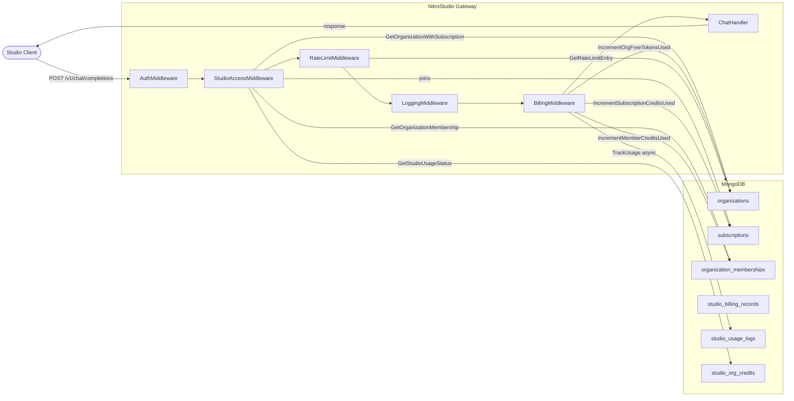
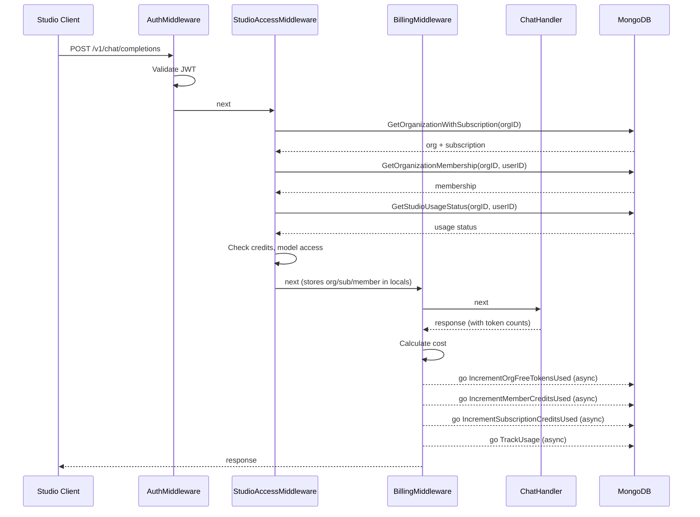
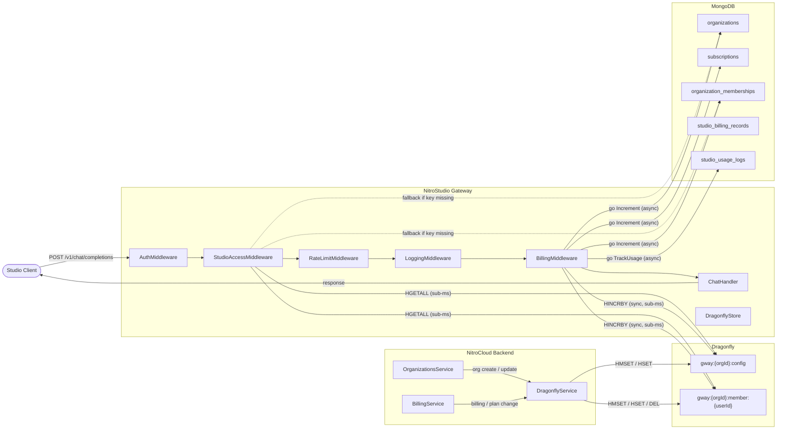
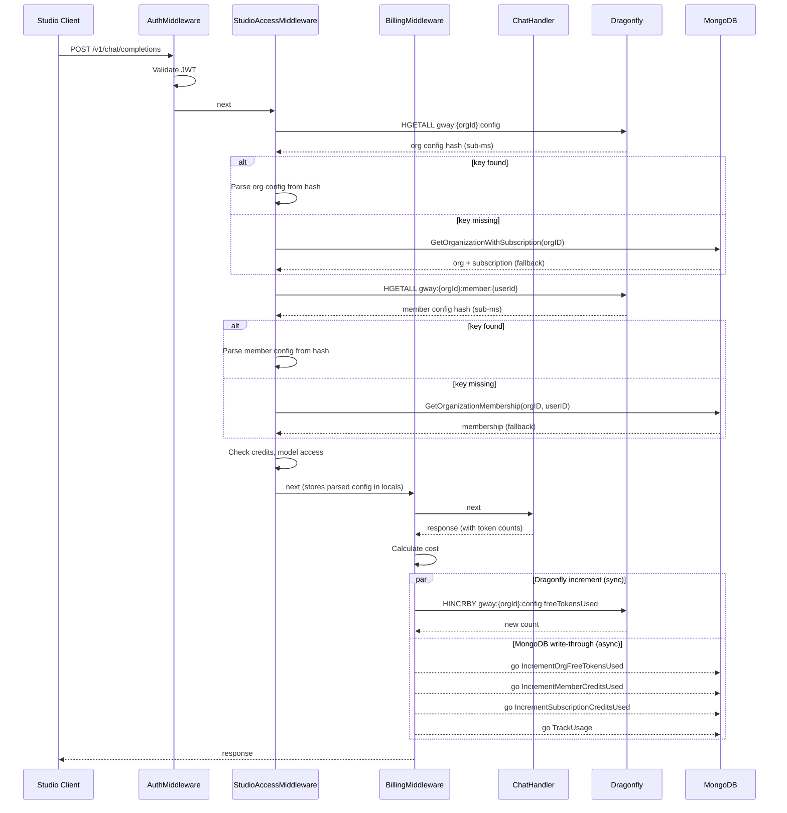

# Implement Dragonfly for Studio Credits (Both Sides)

## Architecture Design

### Current Architecture (MongoDB-only)

Every request through the gateway triggers multiple MongoDB queries to authorize, check credits, and track billing. All reads and writes go through MongoDB.




**Problem:** 3-4 MongoDB queries on the hot path per request (org+sub lookup, membership lookup, usage status). All reads are synchronous and block the request.

---

### Current Request Lifecycle (Sequence)




---

### New Architecture (with DragonflyStore)

Dragonfly replaces MongoDB reads on the hot path. NitroCloud seeds org/member data into Dragonfly. The gateway reads from Dragonfly (sub-millisecond) and falls back to MongoDB only if the key is missing. Billing writes go to both Dragonfly (immediate) and MongoDB (write-through).




---

### New Request Lifecycle (Sequence)




---

### Component Comparison

- **Pre-request reads**: MongoDB (3-4 queries, ~5-15ms each) replaced by Dragonfly (2 HGETALL, sub-ms each)
- **Post-request writes**: MongoDB goroutines (unchanged) + Dragonfly HINCRBY (added, sync, sub-ms)
- **Data seeding**: NitroCloud backend writes to both MongoDB and Dragonfly on every org/member/billing mutation
- **Fallback**: If Dragonfly key is missing or connection is down, seamlessly falls back to existing MongoDB path
- **Consistency**: Dragonfly is eventually consistent with MongoDB; NitroCloud is the seeding authority, gateway increments in both stores

## Key Schema

All keys are prefixed with `gway:` to comply with the Dragonfly ACL (`gway:`*). The `{orgId}` hash tag ensures all keys for the same org co-locate on the same cluster slot.

### `gway:{orgId}:config` (Redis Hash)


| Field                       | Type                | Source                                   | Writable by gateway |
| --------------------------- | ------------------- | ---------------------------------------- | ------------------- |
| `ownerUserId`               | string              | `Organization.owner`                     | No                  |
| `isFreeCreditStudio`        | `"1"/"0"`           | `Organization.isFreeCreditStudio`        | No                  |
| `freeStudioCreditType`      | `"dollar"/"tokens"` | `Organization.freeStudioCreditType`      | No                  |
| `freeCreditAmount`          | int string          | `Organization.freeCreditAmount`          | No                  |
| `freeTokensUsed`            | int string          | `Organization.freeTokensUsed`            | Yes (HINCRBY)       |
| `studioCredits`             | int string          | `Subscription.studioCredits`             | No                  |
| `studioCreditsUsed`         | int string          | `Subscription.studioCreditsUsed`         | Yes (HINCRBY)       |
| `studioUsageBillingEnabled` | `"1"/"0"`           | `Subscription.studioUsageBillingEnabled` | No                  |
| `studioUsageLimit`          | int string          | `Subscription.studioUsageLimit`          | No                  |
| `additionalUsageUsed`       | int string          | `Subscription.additionalUsageUsed`       | Yes (HINCRBY)       |
| `paidModelsEnabled`         | `"1"/"0"`           | `StudioConfig.paidModelsEnabled`         | No                  |
| `allModelsEnabled`          | `"1"/"0"`           | `StudioConfig.allModelsEnabled`          | No                  |
| `allowedModels`             | comma-separated     | `StudioConfig.allowedModels`             | No                  |


### `gway:{orgId}:member:{userId}` (Redis Hash)


| Field                  | Type                       | Source                                  | Writable by gateway |
| ---------------------- | -------------------------- | --------------------------------------- | ------------------- |
| `studioAccess`         | `"1"/"0"`                  | `Membership.studioAccess`               | No                  |
| `creditLimit`          | int string (`"-1"` = none) | `Membership.studioCreditLimit`          | No                  |
| `creditsUsed`          | int string                 | `Membership.studioCreditsUsed`          | Yes (HINCRBY)       |
| `additionalUsageLimit` | int string                 | `Membership.studioAdditionalUsageLimit` | No                  |


### Key Examples

```
gway:{64f1a2b3c4d5e6f7a8b9c0d1}:config          → org studio config hash
gway:{64f1a2b3c4d5e6f7a8b9c0d1}:member:64f9e8d7c6b5a4f3e2d1c0b9  → member hash
```

---

## Part 1: NitroCloud Backend (Seeding Side)

### 1A. Extend DragonflyService

**File:** [backend/src/billing/services/dragonfly.service.ts](backend/src/billing/services/dragonfly.service.ts)

Add methods using `HMSET`, `HSET`, `HINCRBY`, `DEL`. All keys are prefixed with `gway:` for ACL scoping:

- `setOrgStudioConfig(orgId, config)` -- `HMSET gway:{orgId}:config ...`
- `updateOrgStudioFields(orgId, fields)` -- `HSET gway:{orgId}:config field value ...`
- `deleteOrgStudioConfig(orgId)` -- `DEL gway:{orgId}:config`
- `setMemberStudioConfig(orgId, userId, config)` -- `HMSET gway:{orgId}:member:{userId} ...`
- `updateMemberStudioFields(orgId, userId, fields)` -- `HSET gway:{orgId}:member:{userId} ...`
- `deleteMemberStudioConfig(orgId, userId)` -- `DEL gway:{orgId}:member:{userId}`

Add a constant for the key prefix:

```typescript
private readonly KEY_PREFIX = 'gway';

private orgKey(orgId: string): string {
  return `${this.KEY_PREFIX}:{${orgId}}:config`;
}

private memberKey(orgId: string, userId: string): string {
  return `${this.KEY_PREFIX}:{${orgId}}:member:${userId}`;
}
```

Define TypeScript interfaces for the payloads.

### 1B. Hook into Org Creation

**File:** [backend/src/organizations/organizations.service.ts](backend/src/organizations/organizations.service.ts)

In `initializeFreeCreditFields` (~line 208), after the MongoDB `$set`, call:

```typescript
await this.dragonflyService.setOrgStudioConfig(orgId, {
  ownerUserId: userId,
  isFreeCreditStudio: true,
  freeStudioCreditType: creditType,
  freeCreditAmount: creditAmount,
  freeTokensUsed: 0,
  studioCredits: 0,
  studioCreditsUsed: 0,
  studioUsageBillingEnabled: false,
  studioUsageLimit: 0,
  additionalUsageUsed: 0,
  paidModelsEnabled: false,
  allModelsEnabled: false,
  allowedModels: '',
});
```

### 1C. Hook into Member Management

**File:** [backend/src/organizations/organizations.service.ts](backend/src/organizations/organizations.service.ts)


| Method                                   | Dragonfly Call                                                                                                            |
| ---------------------------------------- | ------------------------------------------------------------------------------------------------------------------------- |
| `addMember` / `addMemberViaInvitation`   | `setMemberStudioConfig(orgId, userId, { studioAccess: false, creditLimit: -1, creditsUsed: 0, additionalUsageLimit: 0 })` |
| `removeMember`                           | `deleteMemberStudioConfig(orgId, userId)`                                                                                 |
| `updateMemberStudioAccess` (~line 552)   | `updateMemberStudioFields(orgId, userId, { studioAccess })`                                                               |
| `updateMemberStudioSettings` (~line 782) | `updateMemberStudioFields(orgId, userId, { creditLimit, additionalUsageLimit })`                                          |


### 1D. Hook into Billing/Credit Changes

**File:** [backend/src/billing/billing.service.ts](backend/src/billing/billing.service.ts)


| Event                          | Dragonfly Call                                                                         |
| ------------------------------ | -------------------------------------------------------------------------------------- |
| `topupStudioCredits`           | `updateOrgStudioFields(orgId, { isFreeCreditStudio: false })`                          |
| `updateSubscriptionPlan`       | `updateOrgStudioFields(orgId, { studioCredits, studioCreditsUsed: 0 })`                |
| `syncSubscriptionFromCheckout` | `updateOrgStudioFields(orgId, { studioCredits, studioUsageBillingEnabled, ... })`      |
| Stripe invoice.paid            | Reset credits in Dragonfly                                                             |
| `updateStudioConfig`           | `updateOrgStudioFields(orgId, { paidModelsEnabled, allModelsEnabled, allowedModels })` |


### 1E. Error Handling

All Dragonfly calls are **fire-and-forget** with error logging. A Dragonfly failure must never block the primary MongoDB write. The gateway falls back to MongoDB if Dragonfly data is missing.

---

## Part 2: NitroStudio Gateway (Reading Side)

### 2A. Add Dragonfly Config

**File:** [gateway/internal/config/config.go](gateway/internal/config/config.go)

Add fields to `Config`:

```go
DragonflyAddr        string
DragonflyPassword    string
DragonflyTLS         bool
DragonflyTLSInsecure bool
```

Load from env: `DRAGONFLY_ADDR` (default `localhost:6379`), `DRAGONFLY_PASSWORD`, `DRAGONFLY_TLS`, `DRAGONFLY_TLS_INSECURE`.

### 2B. Create Dragonfly Store Package

**New file:** `gateway/internal/store/dragonfly.go`

- Use `github.com/redis/rueidis` (same as NitroCloud quota-service)
- Implement `NewDragonflyStore(cfg)` that creates a rueidis client
- Define key prefix constant and helper functions:

```go
const keyPrefix = "gway"

func orgConfigKey(orgId string) string {
    return keyPrefix + ":{" + orgId + "}:config"
}

func memberKey(orgId, userId string) string {
    return keyPrefix + ":{" + orgId + "}:member:" + userId
}
```

- Methods:
  - `GetOrgStudioConfig(ctx, orgId)` -- `HGETALL gway:{orgId}:config`, return parsed struct
  - `GetMemberStudioConfig(ctx, orgId, userId)` -- `HGETALL gway:{orgId}:member:{userId}`
  - `IncrementFreeTokensUsed(ctx, orgId, amount)` -- `HINCRBY gway:{orgId}:config freeTokensUsed amount`
  - `IncrementMemberCreditsUsed(ctx, orgId, userId, amount)` -- `HINCRBY gway:{orgId}:member:{userId} creditsUsed amount`
  - `IncrementSubscriptionCreditsUsed(ctx, orgId, amount, isOverage)` -- `HINCRBY gway:{orgId}:config studioCreditsUsed|additionalUsageUsed`
  - `Close()`

### 2C. Modify StudioAccessMiddleware

**File:** [gateway/internal/middleware/studio_access.go](gateway/internal/middleware/studio_access.go)

- Add `store *store.DragonflyStore` field to `StudioAccessMiddleware`
- Replace the MongoDB reads at lines 61 and 87 with Dragonfly reads:
  - `store.GetOrgStudioConfig(ctx, orgID)` instead of `repo.GetOrganizationWithSubscription(ctx, orgID)`
  - `store.GetMemberStudioConfig(ctx, orgID, userID)` instead of `repo.GetOrganizationMembership(ctx, orgID, userID)`
- **Fallback**: If Dragonfly returns empty/nil (key not found), fall back to the existing MongoDB path for backward compatibility during migration
- Owner check uses `orgConfig.OwnerUserId == userID` from the Dragonfly hash
- All credit checks use values from the Dragonfly hash instead of `org`/`sub`/`member` MongoDB structs
- Store parsed config in `c.Locals()` for billing middleware to use

### 2D. Modify BillingMiddleware (Hybrid Increment)

**File:** [gateway/internal/middleware/billing.go](gateway/internal/middleware/billing.go)

- Add `store *store.DragonflyStore` field
- After successful request:
  1. **Dragonfly increment** (fast, atomic): call the appropriate `store.Increment`* method
  2. **MongoDB write-through** (existing behavior): keep the existing `repo.Increment`* calls as-is (runs in goroutine)
- This means Dragonfly is always up-to-date for the next request, while MongoDB remains the durable source of truth

### 2E. Update main.go

**File:** [gateway/cmd/server/main.go](gateway/cmd/server/main.go)

- Initialize `DragonflyStore` after config load (similar to MongoDB init)
- Pass it to `StudioAccessMiddleware` and `BillingMiddleware`
- Add graceful shutdown (`store.Close()`)
- Log connection status

### 2F. Update go.mod

Add dependency: `github.com/redis/rueidis`

### 2G. Update .env

**File:** [gateway/.env](gateway/.env)

Add:

```
DRAGONFLY_ADDR=localhost:6379
DRAGONFLY_PASSWORD=
DRAGONFLY_TLS=false
DRAGONFLY_TLS_INSECURE=true
```

---

## Fallback Strategy

The gateway must **never fail closed** if Dragonfly is unavailable:

1. If `DRAGONFLY_ADDR` is empty/not set, skip Dragonfly entirely and use MongoDB (current behavior)
2. If Dragonfly is connected but returns empty for a key (org not yet seeded), fall back to MongoDB for that request
3. If Dragonfly connection drops, log error and fall back to MongoDB
4. Billing write-through to MongoDB always happens regardless of Dragonfly status

---

## Not In Scope

- Migration script for seeding existing orgs/members into Dragonfly (separate task before go-live)
- `studio_billing_records` -- stays in MongoDB (item 4 from ticket)
- `/studio/usage/status` endpoint -- still reads from MongoDB (not on hot path, skipped by studio_access middleware)
- Dragonfly infrastructure/Helm deployment changes

