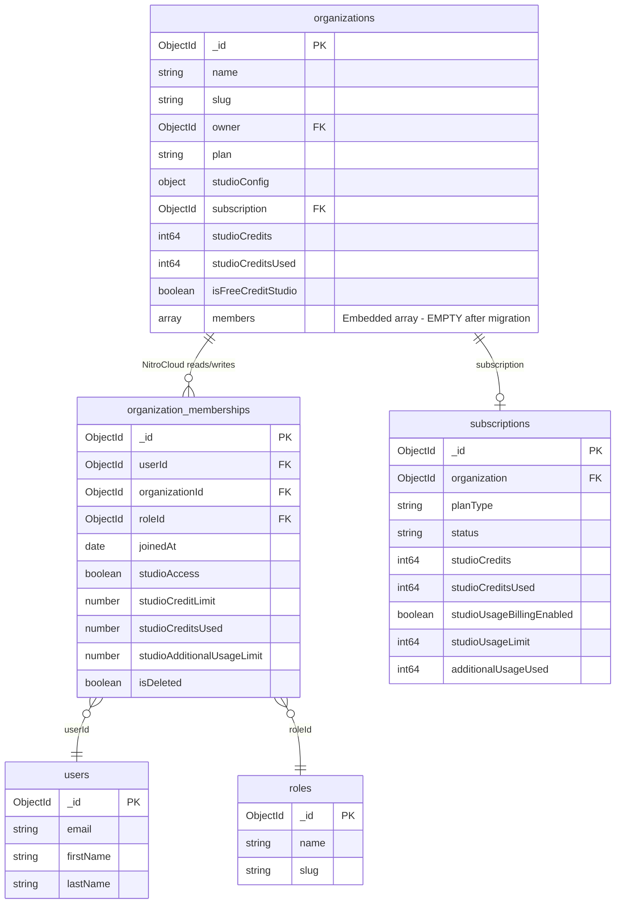
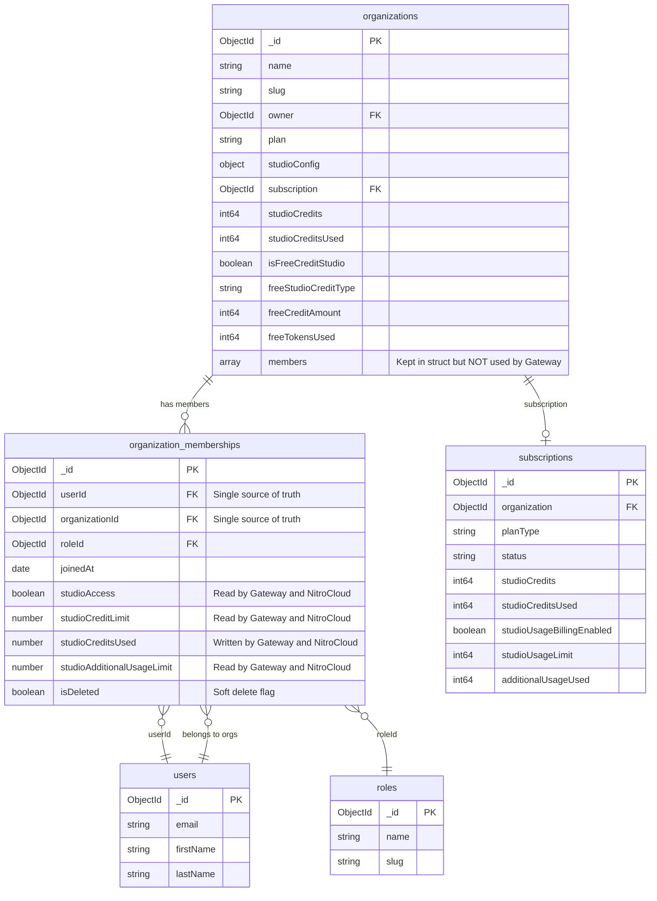

# Organization Membership: Single Source of Truth Migration (Gateway)

## Scope

All changes are **Gateway-only** (nitrostudio/gateway). No changes to NitroCloud backend.

The existing `Organization.Members` embedded array and `OrganizationMember` struct are kept as-is for backward compatibility. The Gateway will use the `organization_memberships` collection as the single source of truth for all membership reads and writes going forward.

---

## Background

Both the **NitroCloud backend** (Node.js/NestJS) and the **Gateway** (Go) share the same MongoDB database (`supermcp`). Organization membership data previously lived as an embedded `members` array inside the `organizations` collection. NitroCloud has migrated this data to a standalone `organization_memberships` collection, but the Gateway still reads/writes the old embedded array.

---

## Current State (Broken)

After the NitroCloud migration script (`migrate-organization-members-to-memberships.ts`) runs, the `members` field on organization documents is `$unset`. The Gateway still attempts to read `organization.members`, which is now empty.

### Impact

- `org.Members` in the Gateway resolves to `nil`/empty
- Non-owner users receive "You are not a member of this organization" on every request
- `IncrementMemberCreditsUsed` silently fails (no matching array element)
- `GetStudioUsageStatus` returns no personal limit data

### ER Diagram - Before Fix (Dual Source of Truth)



**Problem**: The Gateway reads `organizations.members` (embedded, empty) while NitroCloud reads/writes `organization_memberships` (separate collection, populated).

### Affected Gateway Files

| File | What it does with `organization.members` |
|------|------------------------------------------|
| `internal/models/organization.go` | Defines `OrganizationMember` struct and `Organization.Members` field (kept as-is) |
| `internal/repository/collections.go` | Missing `organization_memberships` collection constant |
| `internal/repository/mongo.go` | `IncrementMemberCreditsUsed` writes to `members.$[member]`; `GetStudioUsageStatus` iterates `org.Members` |
| `internal/middleware/studio_access.go` | `ValidateAccess` iterates `org.Members` to find/authorize user |
| `internal/middleware/billing.go` | Calls `IncrementMemberCreditsUsed` (indirectly affected) |
| `internal/handlers/studio.go` | Calls `IncrementMemberCreditsUsed` and `GetStudioUsageStatus` (indirectly affected) |

---

## Target State (Fixed)

The Gateway reads and writes membership data from the `organization_memberships` collection. The `Organization.Members` field and `OrganizationMember` struct remain in the Go model for backward compatibility but are no longer used for access control or credit tracking decisions.

### ER Diagram - After Fix (Single Source of Truth)



---

## Gateway Changes

### Step 1: Add `OrganizationMembership` model and collection constant

**File**: `internal/models/organization.go`

- Add a new `OrganizationMembership` struct matching the `organization_memberships` collection schema:
  - `ID`, `UserID`, `OrganizationID`, `RoleID`, `JoinedAt`
  - `StudioAccess`, `StudioCreditLimit`, `StudioCreditsUsed`, `StudioAdditionalUsageLimit`
  - `IsDeleted`, `DeletedAt`
  - `CreatedAt`, `UpdatedAt`
- Keep `OrganizationMember` struct and `Organization.Members` field unchanged

**File**: `internal/repository/collections.go`

- Add `CollectionOrganizationMemberships = "organization_memberships"`

### Step 2: Add repository method to fetch membership

**File**: `internal/repository/mongo.go`

- Add `GetMembership(ctx, orgID, userID) (*models.OrganizationMembership, error)` that queries:

```go
memberships := r.database.Collection(CollectionOrganizationMemberships)
var membership models.OrganizationMembership
err = memberships.FindOne(ctx, bson.M{
    "organizationId": orgObjID,
    "userId":         userObjID,
    "isDeleted":      bson.M{"$ne": true},
}).Decode(&membership)
```

### Step 3: Update `IncrementMemberCreditsUsed`

**File**: `internal/repository/mongo.go` (line 496)

- Change from updating `members.$[member].studioCreditsUsed` via arrayFilters on `organizations` collection
- To updating `studioCreditsUsed` directly on the matching `organization_memberships` document:

```go
memberships := r.database.Collection(CollectionOrganizationMemberships)
_, err = memberships.UpdateOne(ctx,
    bson.M{
        "organizationId": orgObjID,
        "userId":         userObjID,
        "isDeleted":      bson.M{"$ne": true},
    },
    bson.M{"$inc": bson.M{"studioCreditsUsed": amount}},
)
```

### Step 4: Update `GetStudioUsageStatus`

**File**: `internal/repository/mongo.go` (line 554)

- Replace the `org.Members` iteration (lines 570-578) with a call to `GetMembership()`
- Map `OrganizationMembership` fields to the `member` variable:
  - `membership.StudioAccess` for access check
  - `membership.StudioCreditLimit` for personal limit
  - `membership.StudioCreditsUsed` for personal used
  - `membership.StudioAdditionalUsageLimit` for additional usage

### Step 5: Update `StudioAccessMiddleware.ValidateAccess`

**File**: `internal/middleware/studio_access.go`

- Replace the `org.Members` iteration (lines 77-82) with `repo.GetMembership(orgID, userID)`
- Map the returned `OrganizationMembership` fields into the existing middleware logic
- The middleware still stores member data in `c.Locals("studio_member", ...)` for downstream use
- Personal credit limit checks (line 171) use `membership.StudioCreditLimit` and `membership.StudioCreditsUsed`

### Step 6: Add index creation for `organization_memberships`

**File**: `internal/repository/mongo.go` `createIndexes`

- Add compound index on `{organizationId: 1, userId: 1}` for efficient membership lookups
- This mirrors the unique index NitroCloud already creates on the collection

---

## Access Patterns (After Fix)

### Gateway (Go) - All reads/writes via `organization_memberships`

| Operation | Collection | Query |
|-----------|------------|-------|
| **ValidateAccess** (middleware) | `organization_memberships` | `{organizationId, userId, isDeleted: {$ne: true}}` -- checks `studioAccess` |
| **IncrementMemberCreditsUsed** (repo) | `organization_memberships` | `{organizationId, userId, isDeleted: {$ne: true}}` -- `$inc studioCreditsUsed` |
| **GetStudioUsageStatus** (repo) | `organization_memberships` | `{organizationId, userId, isDeleted: {$ne: true}}` -- reads personal limits |
| **GetStudioUsageStatus** (repo) | `organizations` | `{_id: orgID}` -- reads org config, studioConfig, free credit fields |
| **GetStudioUsageStatus** (repo) | `subscriptions` | `{organization: orgID, status: "ACTIVE"}` -- reads plan credits/overage |

### NitroCloud Backend (Node.js) - Unchanged, already on `organization_memberships`

| Operation | Collection | Query |
|-----------|------------|-------|
| **addMember** | `organization_memberships` | Creates document with `{userId, organizationId, roleId}` |
| **removeMember** | `organization_memberships` | Soft-delete: `{isDeleted: true, deletedAt: now}` |
| **getMembers** | `organization_memberships` | `{organizationId, isDeleted: {$ne: true}}` with populate |
| **updateMemberStudioSettings** | `organization_memberships` | Updates `studioAccess`, `studioCreditLimit`, `studioAdditionalUsageLimit` |
| **getRoleIdForUserInOrg** (RBAC) | `organization_memberships` | `{userId, organizationId, isDeleted: false}` -- returns `roleId` |
| **canUseStudio** (plan enforcement) | `organization_memberships` | Checks `studioAccess`, credit limits |

### Indexes on `organization_memberships`

| Index | Type | Purpose |
|-------|------|---------|
| `{organizationId: 1, userId: 1}` | Unique compound | Fast membership lookup, prevents duplicates |
| `{userId: 1}` | Single field | Find all orgs a user belongs to |
| `{isDeleted: 1}` | Single field | Filter active memberships |

---

## Summary of Changes

| File | Change |
|------|--------|
| `internal/models/organization.go` | Add `OrganizationMembership` struct; keep existing `OrganizationMember` and `Organization.Members` |
| `internal/repository/collections.go` | Add `CollectionOrganizationMemberships` constant |
| `internal/repository/mongo.go` | Add `GetMembership`; rewrite `IncrementMemberCreditsUsed` and `GetStudioUsageStatus` to use `organization_memberships` |
| `internal/middleware/studio_access.go` | Rewrite `ValidateAccess` to use `GetMembership` instead of iterating `org.Members` |
| `internal/middleware/billing.go` | No code change needed (calls `IncrementMemberCreditsUsed` which is updated) |
| `internal/handlers/studio.go` | No code change needed (calls repo methods which are updated) |
