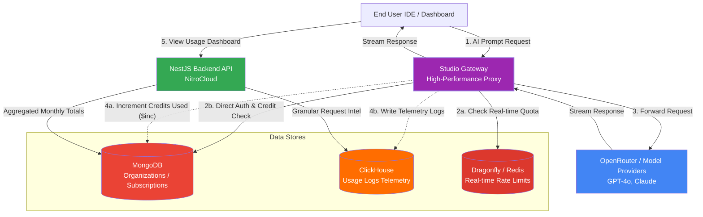

# Studio Usage Architecture & Flow

The [/home/studio-usage](file:///Users/baki/Desktop/wekan/nitrocloud/frontend/app/home/studio-usage) page in NitroCloud provides usage statistics and granular logs for AI model invocations. This is powered by a multi-database architecture and an external Gateway service. Here is the end-to-end flow and architecture.

## 1. Frontend & Presentation Layer
- **Component:** [app/home/studio-usage/page.tsx](file:///Users/baki/Desktop/wekan/nitrocloud/frontend/app/home/studio-usage/page.tsx)
- **Responsibilities:** Renders the Bento-style metrics grid, daily performance charts, and the granular "Call Intelligence" request logs table.
- **API Calls:** 
  - `studioApi.getUsage()`: Gets total tokens, requests, and cost for the current month.
  - `studioApi.getDailyUsage(7)`: Gets a 7-day breakdown for charting.
  - `studioApi.getRequestLogs(1, 10)`: Fetches paginated, raw request telemetry.

## 2. Backend API ([StudioService](file:///Users/baki/Desktop/wekan/nitrocloud/backend/src/studio/studio.service.ts#35-802) & [StudioController](file:///Users/baki/Desktop/wekan/nitrocloud/backend/src/studio/studio.controller.ts#34-310))
Located in `backend/src/studio/`, these serve as the data-retrieval layer for the dashboard:
- **Aggregated Data (MongoDB):** The service queries `studio_billing_records` for month-to-date totals, and `studio_daily_usage` for daily buckets.
- **Granular Logs (ClickHouse):** For high-density telemetry (the Call Intelligence table), the service queries `studio_usage_logs` in **ClickHouse**, which provides efficient, high-performance querying of millions of log rows.

## 3. The Gateway (External Service)
The Gateway is a separate, high-performance proxy service that actually handles the user requests to OpenRouter or other AI model providers.
- **Direct MongoDB Access:** To avoid the latency of calling the NitroCloud backend API on every request, the Gateway queries MongoDB directly. It verifies 3 levels of access in a single aggregation:
  1. **User Authentication:** Checks valid JWT / API keys.
  2. **Member Authorization:** Validates `members[].studioAccess` is true, and checks personal `studioCreditLimit`.
  3. **Org Subscription Check:** Validates the organization's total `studioCredits` and whether overages (`studioUsageBillingEnabled`) are allowed.
- **Usage Sync (Data Ingestion):** After a model request completes, the Gateway directly increments (`$inc`) the usage counters in the `organizations` and `subscriptions` collections. It also writes raw telemetry to **ClickHouse** (`studio_usage_logs`) and inserts tracking records into **MongoDB** (`studio_billing_records`, `studio_daily_usage`).

## 4. Redis / Dragonfly
While MongoDB and ClickHouse store the persistent and billing usage, **Dragonfly (Drop-in Redis replacement)** is used extensively across the platform for fast, in-memory operations and rate-limiting.
- **Implementation:** Leveraged via the `DragonflyService` and `PlanEnforcementService`.
- **Use Case:** It tracks the real-time API request quotas (`totalRequestsThisPeriod`). For example, when an org's payment is overdue and enters a grace period, Dragonfly restricts their quota limit in real-time. It is the primary store for transient request counters (`{orgId}:count`) to enforce rate limits before the more intensive MongoDB/ClickHouse billing syncing happens.

---
### Summary of the Data Flow
1. **User Prompt** → **Gateway**
2. **Gateway** checks **MongoDB** (Auth + Limits) and **Dragonfly** (Rate Limits).
3. **Gateway** calls Model Provider (OpenRouter).
4. **Gateway** increments counters in **MongoDB** and writes raw logs to **ClickHouse**.
5. **User visits `/home/studio-usage`** → **Frontend** calls **Backend**.
6. **Backend** aggregates quick stats from **MongoDB** and streams granular logs from **ClickHouse**.

---
## 5. Architectural Diagram

