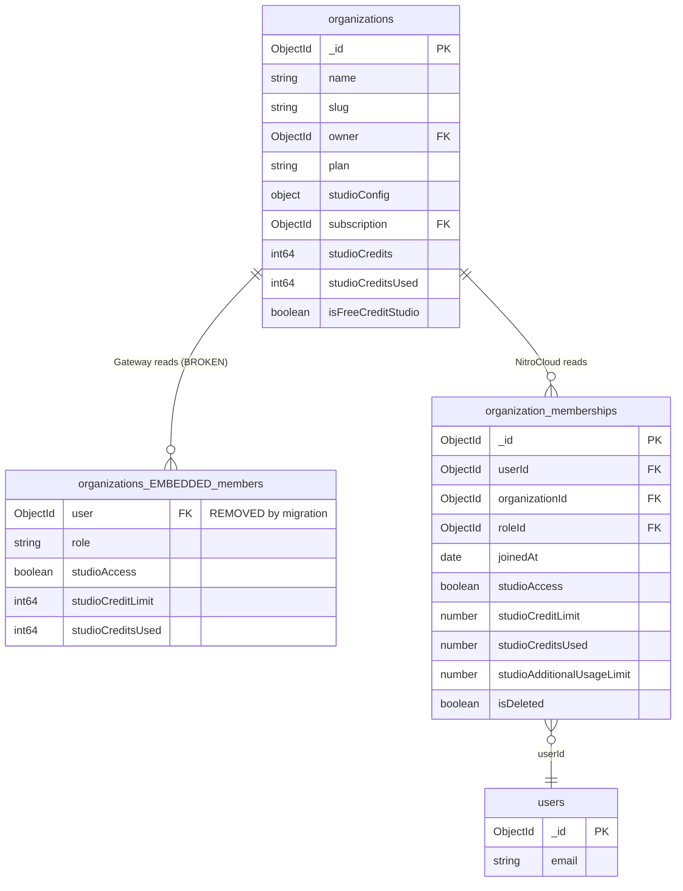

# RFC: Organization Membership — Migration to a Single Source of Truth

## Systems Affected
- NitroCloud Backend (Node.js / NestJS)
- Gateway (Go)
- MongoDB (`supermcp`)

---

# 1. Overview

Organization membership data historically existed as an **embedded array inside the `organizations` collection**.

Recent changes in the **NitroCloud backend** migrated membership data into a dedicated collection:

`organization_memberships`

However, the **Gateway service still relies on the legacy embedded structure**.

This has introduced a **data model inconsistency** that breaks authorization and credit tracking.

This document outlines:

1. The current inconsistency  
2. System impact  
3. The target architecture  
4. Required Gateway changes  
5. Migration steps to achieve a single source of truth  

---

# 2. Problem Summary

Previously membership information lived inside:

```
organizations.members[]
```

NitroCloud introduced a migration script:

```
migrate-organization-members-to-memberships.ts
```

which moved membership data into a normalized collection:

```
organization_memberships
```

and removed the embedded field:

```
$unset: members
```

### Result

The **Gateway still reads `organization.members`**, which no longer exists.

This causes the Gateway to behave as if **no users belong to any organization**.

---

# 3. Current State (Broken Architecture)

## Data Ownership Conflict

| System | Membership Source |
|------|------|
| NitroCloud Backend | `organization_memberships` |
| Gateway | `organizations.members` (deprecated) |

The systems are now reading **two different data models**.

---

## System Impact

The following runtime failures occur in Gateway:

| Component | Impact |
|------|------|
| `ValidateAccess` | Non-owners rejected from Studio |
| `IncrementMemberCreditsUsed` | No array element to update |
| `GetStudioUsageStatus` | No personal limits returned |
| Studio APIs | Authorization failures |

### User-Facing Error

```
"You are not a member of this organization"
```

This occurs for **every non-owner user**.

---

# 4. Current Data Model (Before Fix)



---

# 5. Target Architecture (After Fix)

Both services must read from a **single normalized collection**:

```
organization_memberships
```

The `organizations` collection will **no longer store membership data**.

---

# 6. Access Patterns (After Fix)

## Gateway Responsibilities

| Operation | Collection | Query |
|------|------|------|
| ValidateAccess | `organization_memberships` | `{organizationId, userId, isDeleted: {$ne: true}}` |
| IncrementMemberCreditsUsed | `organization_memberships` | `$inc studioCreditsUsed` |
| GetStudioUsageStatus | `organization_memberships` | Read user limits |
| GetStudioUsageStatus | `organizations` | Read org config |
| GetStudioUsageStatus | `subscriptions` | Read billing limits |

---

## NitroCloud Responsibilities

| Operation | Collection |
|------|------|
| Add Member | `organization_memberships` |
| Remove Member | `organization_memberships` (soft delete) |
| Update Member Settings | `organization_memberships` |
| RBAC Lookup | `organization_memberships` |
| Plan Enforcement | `organization_memberships` |

---

# 7. Required Gateway Changes

The Gateway must be updated to **completely stop using the embedded members array**.

### Files Affected

| File | Change |
|------|------|
| `internal/models/organization.go` | Remove `OrganizationMember` |
| `internal/models/organization.go` | Add `OrganizationMembership` model |
| `internal/repository/collections.go` | Add collection constant |
| `internal/repository/mongo.go` | Replace member array logic |
| `internal/middleware/studio_access.go` | Replace membership lookup |
| `internal/handlers/studio.go` | Indirect usage fix |

---

# 8. New Repository Access Layer

A reusable repository method should be introduced:

```go
GetMembership(ctx, organizationID, userID)
```

Query:

```json
{
  "organizationId": "orgID",
  "userId": "userID",
  "isDeleted": { "$ne": true }
}
```

This becomes the **single entry point** for membership resolution.

---

# 9. Database Index Strategy

To support Gateway access patterns efficiently:

| Index | Purpose |
|------|------|
| `{organizationId: 1, userId: 1}` (unique) | Fast membership lookup |
| `{userId: 1}` | Fetch all user organizations |
| `{isDeleted: 1}` | Filter active memberships |

---

# 10. Migration Plan

## Step 1 — Gateway Model Refactor

Remove:

```
Organization.Members
OrganizationMember struct
```

Add:

```
OrganizationMembership struct
```

---

## Step 2 — Repository Layer

Add collection constant:

```
CollectionOrganizationMemberships
```

Implement repository method:

```
GetMembership()
```

---

## Step 3 — Access Middleware

Update:

```
StudioAccessMiddleware.ValidateAccess
```

Old behavior:

```
iterate org.Members
```

New behavior:

```
query organization_memberships
```

---

## Step 4 — Credit Usage Tracking

Update:

```
IncrementMemberCreditsUsed
```

Old implementation:

```
members.$[member].studioCreditsUsed
```

New implementation:

```
$inc studioCreditsUsed
```

on `organization_memberships`.

---

## Step 5 — Usage Status

Update:

```
GetStudioUsageStatus
```

Replace:

```
org.Members iteration
```

with:

```
GetMembership()
```

---

## Step 6 — Index Creation

Ensure index creation during service startup:

```
{organizationId: 1, userId: 1}
```

---

## Step 7 — NitroCloud Script Fix

File:

```
backend/src/scripts/reset-studio-credits.ts
```

Old behavior:

```
members.$[].studioCreditsUsed
```

New behavior:

```
updateMany organization_memberships
```

---

# 11. Final Architecture

```
Gateway ─────┐
             │
             ▼
    organization_memberships
             ▲
             │
NitroCloud ──┘
```

Both services rely on a **single normalized membership model**, eliminating data duplication and authorization inconsistencies.

---

# 12. Benefits of the Fix

### Consistency
One authoritative membership source.

### Reliability
Gateway authorization works correctly.

### Scalability
Normalized schema supports large organizations.

### RBAC Compatibility
Membership tied directly to roles.

---

# 13. Risk Assessment

| Risk | Mitigation |
|------|------|
| Gateway still referencing old field | Remove struct entirely |
| Missing indexes | Create during startup |
| Scripts updating old schema | Update NitroCloud scripts |

---

# 14. Conclusion

The Gateway must migrate to the **`organization_memberships` collection** to align with NitroCloud’s updated schema.

This migration:

- fixes broken authorization
- restores correct credit tracking
- ensures both systems operate on a **single source of truth**

Once implemented, the legacy embedded `members` array will be permanently deprecated.
