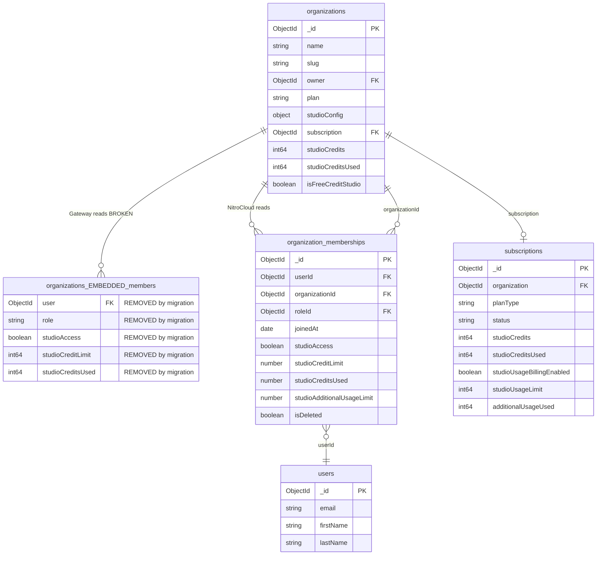
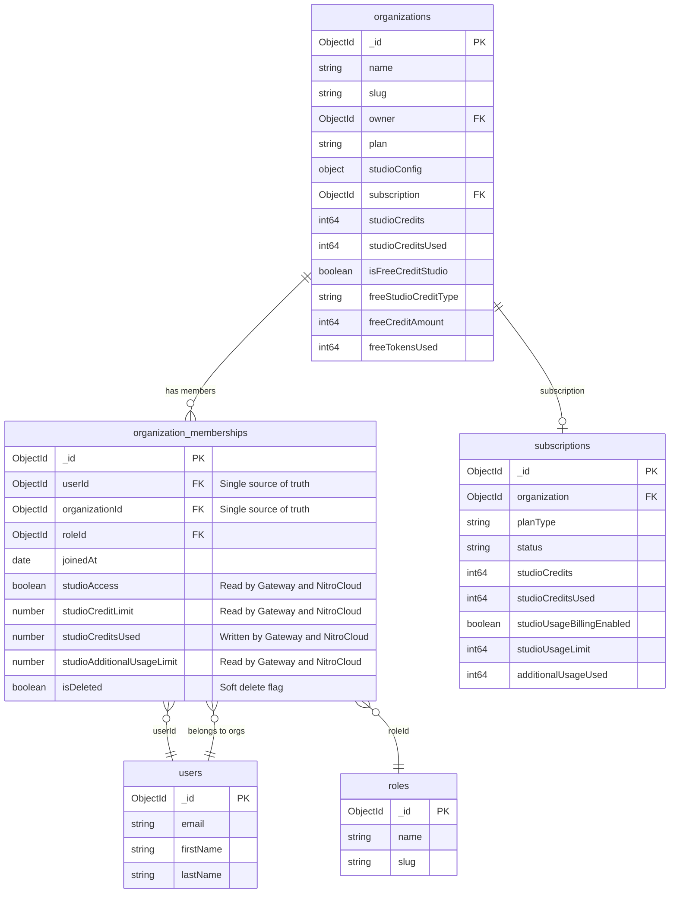

# Organization Membership: Migration to Single Source of Truth

## Background

Both the **NitroCloud backend** (Node.js/NestJS) and the **Gateway** (Go) share the same MongoDB database (`supermcp`). Organization membership data previously lived as an embedded `members` array inside the `organizations` collection. NitroCloud has migrated this data to a standalone `organization_memberships` collection, but the Gateway still reads/writes the old embedded array.

This document describes the data model conflict and the migration path to a single source of truth.

---

## Current State (Broken)

After the NitroCloud migration script (`migrate-organization-members-to-memberships.ts`) runs, the `members` field on organization documents is `$unset`. The Gateway still attempts to read `organization.members`, which is now empty.

### Impact

- `org.Members` in the Gateway resolves to `nil`/empty
- Non-owner users receive "You are not a member of this organization" on every request
- `IncrementMemberCreditsUsed` silently fails (no matching array element)
- `GetStudioUsageStatus` returns no personal limit data

### ER Diagram - Before Fix

### Affected Gateway Files

| File | Issue |
|------|-------|
| `internal/models/organization.go` | Defines `OrganizationMember` struct and `Organization.Members` field |
| `internal/repository/collections.go` | Missing `organization_memberships` collection constant |
| `internal/repository/mongo.go` | `IncrementMemberCreditsUsed` writes to `members.$[member]`; `GetStudioUsageStatus` iterates `org.Members` |
| `internal/middleware/studio_access.go` | `ValidateAccess` iterates `org.Members` to find/authorize user |
| `internal/middleware/billing.go` | Calls `IncrementMemberCreditsUsed` (indirectly affected) |
| `internal/handlers/studio.go` | Calls `IncrementMemberCreditsUsed` and `GetStudioUsageStatus` (indirectly affected) |

### Affected NitroCloud File

| File | Issue |
|------|-------|
| `backend/src/scripts/reset-studio-credits.ts` | Still updates `members.$[].studioCreditsUsed` which no longer exists post-migration |

---

## Target State (Fixed)

Both systems read and write membership data from the `organization_memberships` collection. The `organizations` collection no longer contains a `members` field.

### ER Diagram - After Fix

---

## Access Patterns (After Fix)

### Gateway (Go)

| Operation | Collection | Query |
|-----------|------------|-------|
| **ValidateAccess** (middleware) | `organization_memberships` | `{organizationId, userId, isDeleted: {$ne: true}}` — checks `studioAccess` |
| **IncrementMemberCreditsUsed** (repo) | `organization_memberships` | `{organizationId, userId, isDeleted: {$ne: true}}` — `$inc studioCreditsUsed` |
| **GetStudioUsageStatus** (repo) | `organization_memberships` | `{organizationId, userId, isDeleted: {$ne: true}}` — reads personal limits |
| **GetStudioUsageStatus** (repo) | `organizations` | `{_id: orgID}` — reads org config, studioConfig, free credit fields |
| **GetStudioUsageStatus** (repo) | `subscriptions` | `{organization: orgID, status: "ACTIVE"}` — reads plan credits/overage |

### NitroCloud Backend (Node.js)

| Operation | Collection | Query |
|-----------|------------|-------|
| **addMember** | `organization_memberships` | Creates document with `{userId, organizationId, roleId}` |
| **removeMember** | `organization_memberships` | Soft-delete: `{isDeleted: true, deletedAt: now}` |
| **getMembers** | `organization_memberships` | `{organizationId, isDeleted: {$ne: true}}` with populate |
| **updateMemberStudioSettings** | `organization_memberships` | Updates `studioAccess`, `studioCreditLimit`, `studioAdditionalUsageLimit` |
| **getRoleIdForUserInOrg** (RBAC) | `organization_memberships` | `{userId, organizationId, isDeleted: false}` — returns `roleId` |
| **canUseStudio** (plan enforcement) | `organization_memberships` | Checks `studioAccess`, credit limits |

### Indexes

The `organization_memberships` collection has the following indexes:

| Index | Type | Purpose |
|-------|------|---------|
| `{organizationId: 1, userId: 1}` | Unique compound | Fast membership lookup, prevents duplicates |
| `{userId: 1}` | Single field | Find all orgs a user belongs to |
| `{isDeleted: 1}` | Single field | Filter active memberships |

---

## Migration Steps

1. **Gateway model** — Add `OrganizationMembership` struct; remove `Organization.Members` and old `OrganizationMember` struct
2. **Gateway collection** — Add `CollectionOrganizationMemberships = "organization_memberships"`
3. **Gateway repo** — Add `GetMembership(ctx, orgID, userID)` querying `organization_memberships`
4. **Gateway repo** — Update `IncrementMemberCreditsUsed` to write to `organization_memberships`
5. **Gateway repo** — Update `GetStudioUsageStatus` to use `GetMembership` instead of `org.Members`
6. **Gateway middleware** — Update `StudioAccessMiddleware.ValidateAccess` to use `GetMembership`
7. **Gateway repo** — Add compound index on `{organizationId, userId}` in `createIndexes`
8. **NitroCloud script** — Fix `reset-studio-credits.ts` to reset `studioCreditsUsed` on `organization_memberships`
