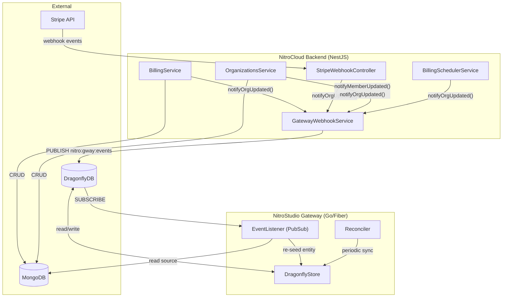
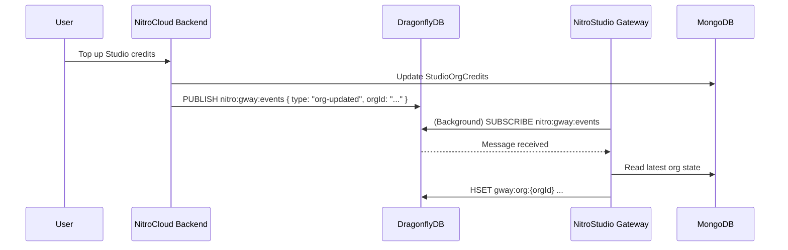

# Gateway Dragonfly Synchronization (Redis Pub/Sub)

> [!TIP]
> **TL;DR:** When NitroCloud mutates billing or member state in MongoDB, it publishes an event to a shared **Redis Pub/Sub channel**. The Gateway listens to this channel and **immediately re-seeds** the Dragonfly cache, bypassing the 5-minute reconciliation cycle without the overhead of HTTP webhooks.

## Overview

NitroStudio Gateway uses **DragonflyDB** (Redis-compatible) as a hot-path cache for organization credits, member access control, and rate limiting. When the NitroCloud backend mutates billing or membership state in MongoDB, it notifies the gateway via Redis Pub/Sub so the cache can be updated immediately — instead of waiting for the periodic reconciliation cycle (every 5 minutes).

This document explains the Pub/Sub integration that keeps the two systems in sync.

---

## Why Redis Pub/Sub?

Instead of HTTP webhooks, we use Redis Pub/Sub over the shared Dragonfly instance because:
1. **No URL Management**: NitroCloud doesn't need to know the Gateway's network address.
2. **Infrastructure Simplicity**: No need for internal load balancers or complex networking rules between services.
3. **Low Latency**: Native Redis messaging is faster and lighter than HTTP.

Webhooks/Events solve the latency of:
1. **Full seed on startup** — reads all orgs/members from MongoDB into Dragonfly
2. **Periodic reconciler** — runs every 5 minutes, compares Dragonfly vs MongoDB, fixes drift

---

## Architecture



---

## Pub/Sub Channel & Message Format

**Channel**: `nitro:gway:events`

### Message Payload
Messages are sent as JSON strings:

| Field | Type | Description |
|-------|------|-------------|
| `type` | string | `org-updated`, `member-updated`, `period-reset`, `reconcile` |
| `orgId` | string | MongoDB ObjectId hex string |
| `userId` | string | Required for `member-updated` |
| `event` | string | Human-readable event reason (e.g. `credit_topup`) |

**Example:**
```json
{
  "type": "org-updated",
  "orgId": "65f1a...",
  "event": "credit_topup"
}
```

---

## Entry Points (Where Events Are Published)

### BillingService (`src/billing/billing.service.ts`)

| Method | Event | Type |
|--------|-------|------|
| `createSubscription()` | `subscription_created` | `org-updated` |
| `updateSubscriptionPlan()` | `plan_changed` | `org-updated` |
| `toggleUsageBasedBilling()` | `usage_billing_toggled` | `org-updated` |
| `cancelSubscription()` | `subscription_canceled` | `org-updated` |
| `topupStudioCredits()` | `credit_topup` | `org-updated` |
| `topupNitroChatCredits()` | `credit_topup` | `org-updated` |

---

### StripeWebhookController (`src/billing/stripe-webhook.controller.ts`)

| Handler | Event | Type |
|---------|-------|------|
| `handleInvoicePaid()` | `invoice_paid` | `org-updated` |
| `handleSubscriptionUpdated()` | `subscription_updated` | `org-updated` |
| `handleSubscriptionDeleted()` | `subscription_deleted` | `org-updated` |
| `handlePaymentIntentSucceeded()` | `credit_topup` | `org-updated` |
| `handleChargeRefunded()` | `credit_refund` | `org-updated` |

---

### OrganizationsService (`src/organizations/organizations.service.ts`)

| Method | Event | Type |
|--------|-------|------|
| `create()` | `org_created` | `org-updated` |
| `addMember()` | `member_added` | `member-updated` |
| `removeMember()` | `member_removed` | `member-updated` |
| `updateMemberStudioAccess()` | `member_updated` | `member-updated` |
| `updateStudioConfig()` | `studio_config_updated` | `org-updated` |

---

## Data Flow



---

## Configuration

### NitroCloud Backend (`.env`)

```env
# Shared Dragonfly/Redis connection
REDIS_URL=redis://localhost:6379
```

### NitroStudio Gateway (`.env`)

```env
DRAGONFLY_ENABLED=true
DRAGONFLY_ADDR=localhost:6379
DRAGONFLY_PASSWORD=
```

---

## Failure Handling

All synchronization events are **fire-and-forget**:

- If NitroCloud fails to publish, the Gateway won't know until the next 5-minute reconciliation.
- If the Gateway is down, the message is lost (standard Pub/Sub behavior).
- The **periodic reconciler** acts as the ultimate consistency backstop by running a full sync every 5 minutes.
- This ensures eventual consistency even if transient messaging failures occur.
