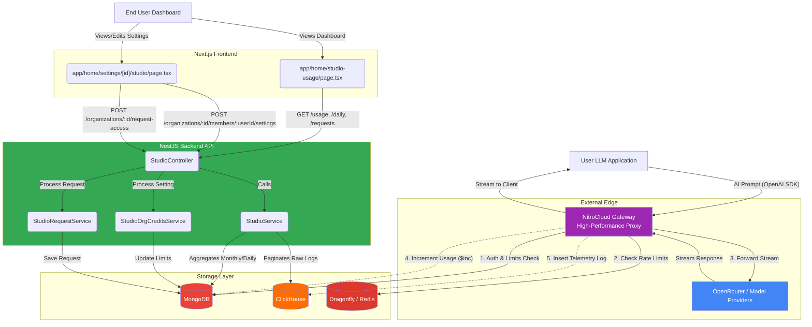

# Studio Architecture: Time Complexity & Performance Analysis

Based on a thorough review of the Studio architecture ([studio.service.ts](file:///Users/baki/Desktop/wekan/nitrocloud/backend/src/studio/studio.service.ts), [studio.controller.ts](file:///Users/baki/Desktop/wekan/nitrocloud/backend/src/studio/studio.controller.ts), [studio-org-credits.service.ts](file:///Users/baki/Desktop/wekan/nitrocloud/backend/src/studio/studio-org-credits.service.ts), and the system design summary), here is a breakdown of how "expensive" the calculations and calls are.

The overall architecture is highly optimized. It completely avoids doing heavy analytical calculations in MongoDB or Node.js by leveraging **ClickHouse** for big data and **Dragonfly (Redis)** for high-frequency operations.

## 1. Backend API (Dashboard & Metrics)

The primary operations for rendering the `/home/studio-usage` page involve querying usage statistics.

### A. Monthly/Daily Aggregations (MongoDB)
- **Functions:** [getUserStudioUsage](file:///Users/baki/Desktop/wekan/nitrocloud/backend/src/studio/studio.service.ts#474-519), [getUserDailyUsage](file:///Users/baki/Desktop/wekan/nitrocloud/backend/src/studio/studio.service.ts#520-590), [getOrganizationStudioUsage](file:///Users/baki/Desktop/wekan/nitrocloud/backend/src/studio/studio.service.ts#692-758)
- **What it does:** Queries the `studio_billing_records` and `studio_daily_usage` collections for the current user/org and a specific date range, then runs an in-memory `.reduce()` to sum the totals.
- **Time Expense: Extremely Cheap (< 50ms)**
  - **Complexity:** [O(N)](file:///Users/baki/Desktop/wekan/nitrocloud/backend/src/studio/schemas/studio-org-credits.schema.ts#15-38) where N is the number of returned records.
  - Because records are pre-aggregated per day (`studio_daily_usage`) and per month (`studio_billing_records`), a 7-day query for a user only returns 7 to `7 * (number of orgs)` documents.
  - Grouping and summing an array of <100 objects in Node.js takes less than `0.1` milliseconds.
  - Relying on MongoDB indexes (`user_id`, `organization_id`, [date](file:///Users/baki/Desktop/wekan/nitrocloud/backend/src/studio/studio.controller.ts#255-263), `period`) makes the database lookup near-instantaneous.

### B. Request Logs / Call Intelligence (ClickHouse)
- **Functions:** [getUserRequestLogs](file:///Users/baki/Desktop/wekan/nitrocloud/backend/src/studio/studio.service.ts#591-691)
- **What it does:** Executes `SELECT COUNT(*)` and a paginated `SELECT ... LIMIT X OFFSET Y` against ClickHouse.
- **Time Expense: Very Cheap (< 100ms)**
  - **Complexity:** Time complexity for columnar aggregation/counting in ClickHouse is massively parallelized.
  - Even if a user generates 5 million request logs, ClickHouse can count and paginate them in milliseconds. Standard MongoDB would choke on `.countDocuments()` and `.skip()` for millions of records, but ClickHouse handles this as intended.

### C. Available Models (Service Call)
- **Functions:** [getOpenRouterModels](file:///Users/baki/Desktop/wekan/nitrocloud/backend/src/studio/studio.service.ts#759-801)
- **What it does:** Makes an HTTP GET request to `https://openrouter.ai/api/v1/models`.
- **Time Expense: Most Expensive (200ms - 800ms)**
  - This is the slowest operation in the dashboard flow, as it relies on an external network round-trip and OpenRouter's API response time.
  - However, the backend provides an immediate hardcoded fallback if the API fails, preventing application hangs.

## 2. Gateway Proxy (Ingestion & Rate Limiting)

When a user actually generates text, they hit the Gateway. This path must be the fastest, as any delay adds to the perceived LLM latency.

### A. Auth & Subscription Checks (MongoDB)
- **Mechanism:** Gateway verifies user tokens, member `studioAccess` flags, and total requested org `studioCredits` via a direct MongoDB query or aggregation.
- **Time Expense: Cheap (< 20ms)**
  - Using proper indexes on the `organizations` and `users` collections ensures this is a quick [O(1)](file:///Users/baki/Desktop/wekan/nitrocloud/backend/src/studio/schemas/studio-org-credits.schema.ts#15-38) or [O(log N)](file:///Users/baki/Desktop/wekan/nitrocloud/backend/src/studio/schemas/studio-org-credits.schema.ts#15-38) lookup. 

### B. Rate Limiting (Dragonfly / Redis)
- **Mechanism:** The Gateway checks Dragonfly for `totalRequestsThisPeriod` or burst quotas before routing to OpenRouter.
- **Time Expense: Almost Free (< 1ms)**
  - Redis/Dragonfly operations are heavily multi-threaded in-memory operations. Fetching and incrementing a counter (`INCR`) operates in [O(1)](file:///Users/baki/Desktop/wekan/nitrocloud/backend/src/studio/schemas/studio-org-credits.schema.ts#15-38) time complexity and essentially has zero structural overhead.

### C. Telemetry Ingestion (MongoDB & ClickHouse)
- **Mechanism:** After the LLM replies, Gateway performs a `$inc` on MongoDB billing counters and inserts a raw telemetry row into ClickHouse.
- **Time Expense: Negligible (Fire-and-Forget)**
  - Gateway does not make the user wait for these writes to finish (asynchronous ingestion).
  - MongoDB `$inc` is an atomic [O(1)](file:///Users/baki/Desktop/wekan/nitrocloud/backend/src/studio/schemas/studio-org-credits.schema.ts#15-38) update.
  - ClickHouse allows massive asynchronous burst writes.

## 3. Organizational Credits Service
- **Functions:** [getCreditsForOrganization](file:///Users/baki/Desktop/wekan/nitrocloud/backend/src/studio/studio-org-credits.service.ts#84-115), [recordUsage](file:///Users/baki/Desktop/wekan/nitrocloud/backend/src/studio/studio-org-credits.service.ts#116-135)
- **What it does:** Calculates total credits used by querying `studio_billing_records` and summing `total_cost`.
- **Time Expense: Very Fast (< 20ms)**
  - Even for an organization with 1,000 members, reading 1,000 billing records for the active month and summing their costs in Node.js [O(N)](file:///Users/baki/Desktop/wekan/nitrocloud/backend/src/studio/schemas/studio-org-credits.schema.ts#15-38) is trivial. 
  - [recordUsage](file:///Users/baki/Desktop/wekan/nitrocloud/backend/src/studio/studio-org-credits.service.ts#116-135) leverages atomic `$inc` updates via `findOneAndUpdate`, removing the need for manual concurrency locking.

## Summary

There are **zero "expensive" calculations** in the Studio architecture. 
- You do not use massive MongoDB aggregation pipelines (`$group`, `$lookup`) on raw telemetry data.
- You avoid reading raw requests to calculate monthly billing (using pre-incremented records instead).
- The only potential bottleneck is the external HTTP request to fetch OpenRouter models. Everything database-side is strictly [O(1)](file:///Users/baki/Desktop/wekan/nitrocloud/backend/src/studio/schemas/studio-org-credits.schema.ts#15-38) (Redis/MongoDB updates) or localized analytical queries [O(N)](file:///Users/baki/Desktop/wekan/nitrocloud/backend/src/studio/schemas/studio-org-credits.schema.ts#15-38) handled by the ideal engine (ClickHouse).

## 4. Entity-Relationship (ER) Diagram

The following ER diagram maps the data models used to support the Studio calculations, telemetry, and permissions across MongoDB and ClickHouse.

```mermaid
erDiagram
    %% Core Entities
    User ||--o{ OrganizationMember : "belongs to"
    Organization ||--o{ OrganizationMember : "contains"
    Organization ||--o| StudioOrgCredits : "holds"

    %% Studio Usage & Billing (MongoDB)
    Organization ||--o{ StudioBillingRecord : "billed for"
    User ||--o{ StudioBillingRecord : "generates"

    Organization ||--o{ StudioDailyUsage : "aggregates"
    User ||--o{ StudioDailyUsage : "aggregates"

    %% Telemetry (ClickHouse)
    Organization ||--o{ StudioUsageLog : "telemetry"
    User ||--o{ StudioUsageLog : "telemetry"

    %% Requests & Deployments
    Organization ||--o{ StudioRequest : "receives"
    User ||--o{ StudioRequest : "makes"

    Organization ||--o{ StudioDeployment : "hosts"
    User ||--o{ StudioDeployment : "deploys"

    User {
        ObjectId id PK
        string email
    }
    
    Organization {
        ObjectId id PK
        string name
    }

    OrganizationMember {
        ObjectId id PK
        ObjectId userId FK
        ObjectId organizationId FK
        boolean studioAccess
        number studioAdditionalUsageLimit
    }

    StudioOrgCredits {
        ObjectId id PK
        ObjectId organization FK
        number creditsTotal
        number creditsUsed
        string currentPeriod
    }

    StudioBillingRecord {
        ObjectId id PK
        string organization_id FK
        string user_id FK
        string period "YYYY-MM"
        number total_tokens
        number total_cost
        number total_requests
    }

    StudioDailyUsage {
        ObjectId id PK
        string organization_id FK
        string user_id FK
        string date "YYYY-MM-DD"
        string model
        number total_tokens
        number total_cost
        number total_requests
    }
    
    StudioUsageLog {
        String id PK "ClickHouse UUID"
        String organization_id FK
        String user_id FK
        DateTime created_at
        String model
        Float64 cost
        Int32 status_code
        Int32 latency_ms
    }

    StudioRequest {
        ObjectId id PK
        ObjectId user FK
        ObjectId organization FK
        string type "access | additional_usage"
        string status "pending | approved | rejected"
        number requestedAmount
    }

    StudioDeployment {
        ObjectId id PK
        ObjectId userId FK
        ObjectId projectId FK
        ObjectId organizationId FK
        string status
        string s3Key
    }
```

## 5. Service & Function Communication Architecture

The following diagram illustrates the active communication paths between the user, frontend components, external gateway, and internal backend services within the Studio architecture.

