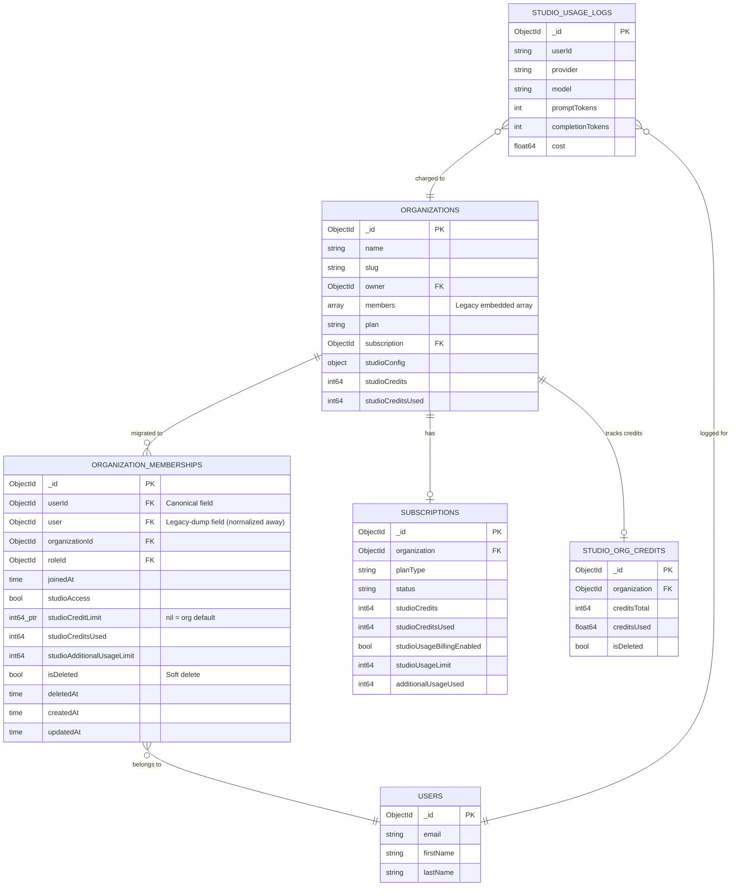
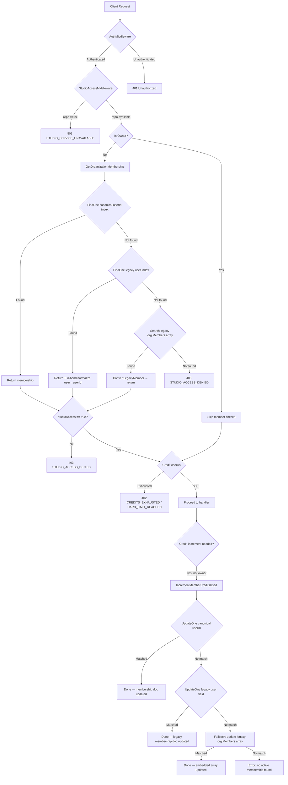
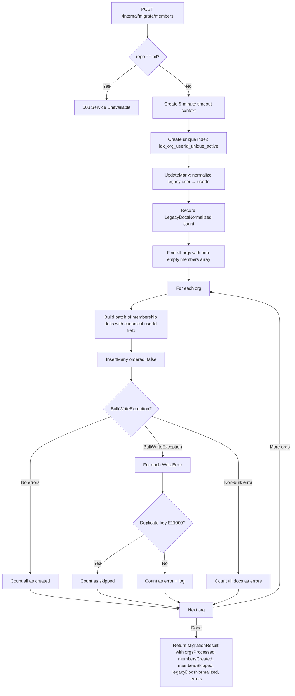

# PR #49 — Testing Guide

## Migrate Membership Lookups to Dedicated Collection & Harden Access Middleware

**PR**: [#49](https://github.com/nitrocloudofficial/nitrostudio/pull/49)
**Branch**: `feature/fix-org-members-inconsistency` → `feature/free-credit-mode`
**Author**: Hemant Jadhav

---

## Summary

This PR replaces the legacy embedded `members[]` array on the `organizations` document with lookups against a dedicated `organization_memberships` collection. Key changes:

- New `OrganizationMembership` model mapped to `organization_memberships` collection
- New `GetOrganizationMembership()` repo method with two-step index lookup (canonical `userId` index first, legacy `user` index second) before falling back to embedded `org.Members`
- `IncrementMemberCreditsUsed` rewritten with three-step resolution: canonical `userId` index → legacy `user` index → embedded `org.Members` array fallback
- `GetStudioUsageStatus` accepts optional `prefetchedMember` to avoid redundant DB calls; returns explicit error for non-members
- Fail-closed access control (503 instead of silently allowing when repo is nil)
- Migration endpoint `POST /internal/migrate/members` with 5-minute timeout, `InsertMany(ordered:false)` batch inserts, and pre-migration normalization of legacy `user` → `userId` fields
- `AuthMiddleware` refactored: private `authenticate()` extracted so `AuthenticateAdmin` no longer double-calls `c.Next()`
- `PricingService.saveToDB` converted from per-model `UpdateOne` to `BulkWrite(ordered:false)` for efficiency
- In-band (synchronous) normalization of legacy-dumped docs when found via the `user` field — replaces the earlier fire-and-forget goroutine approach
- Degraded-mode guards in `LoggingMiddleware`, `UsageWorker`, and `StudioAccessMiddleware`
- Two compound indexes created at startup: `idx_org_userId_unique_active` (canonical) and `idx_org_user_legacy_deleted` (backward compat)

---

## ER Diagram — Data Model & Testing Flow



---

## Request Flow Diagram



---

## Migration Flow Diagram



---

## Prerequisites

1. **MongoDB** running locally or accessible via connection string
2. **Admin JWT token** (the migration endpoint requires `AuthenticateAdmin`)
3. **Test user accounts**: at least one org owner + one non-owner member
4. **Gateway service** running locally (`go run ./cmd/server`)

---

## Step-by-Step Testing Guide

### Phase 1: Run Unit Tests

```bash
cd gateway

# Run model tests
go test ./internal/models/ -v -run TestConvertLegacyMember

# Run membership repository tests
go test ./internal/repository/ -v -run TestGetOrganizationMembership
go test ./internal/repository/ -v -run TestMembershipRawToMembership
go test ./internal/repository/ -v -run TestIncrementMemberCreditsUsed

# Run migration tests
go test ./internal/repository/ -v -run TestMigrateEmbeddedMembers

# Run all tests together
go test ./internal/... -v
```

**Expected**: All tests pass. Verify output covers:
- Canonical `userId` index lookup (single-index query)
- Legacy `user` field lookup with in-band normalization
- Fallback to embedded `org.Members`
- Three-step `IncrementMemberCreditsUsed` resolution (canonical → legacy field → org array)
- Error propagation for DB failures at each step
- Invalid ObjectID rejection
- Migration: batch `InsertMany` success, duplicate key skipping, partial failures, multi-org processing, legacy doc normalization count

---

### Phase 2: Database Preparation

#### Step 1 — Verify existing data

```bash
# Connect to MongoDB
mongosh

# Switch to your database
use nitrocloud

# Check if organizations have embedded members
db.organizations.find({ "members.0": { $exists: true } }).count()

# Sample an org with members
db.organizations.findOne({ "members.0": { $exists: true } }, { name: 1, members: 1 })
```

#### Step 2 — Check the new collection (should be empty or non-existent pre-migration)

```bash
db.organization_memberships.countDocuments()
# Expected: 0 (or collection doesn't exist yet)
```

---

### Phase 3: Test Migration Endpoint

#### Step 3 — Run the migration

```bash
# Replace <ADMIN_TOKEN> with a valid admin JWT
curl -X POST http://localhost:8080/internal/migrate/members \
  -H "Authorization: Bearer <ADMIN_TOKEN>" \
  -H "Content-Type: application/json"
```

**Expected response** (status 200):
```json
{
  "success": true,
  "data": {
    "orgsProcessed": 5,
    "membersCreated": 12,
    "membersSkipped": 0,
    "legacyDocsNormalized": 0,
    "errors": 0
  }
}
```

> **Note**: The endpoint uses a 5-minute server-side timeout (`context.WithTimeout`).
> On failure the response returns `"Migration failed. Check server logs for details."` — the raw error is only logged server-side.

#### Step 4 — Verify migration results

```bash
mongosh
use nitrocloud

# Count migrated memberships
db.organization_memberships.countDocuments()

# Verify a specific membership — should have canonical "userId" field
db.organization_memberships.findOne({ organizationId: ObjectId("<ORG_ID>") })

# Verify all docs use canonical "userId" field
db.organization_memberships.find({ "userId": { $exists: true } }).count()

# Check no legacy "user" field remains (migration normalizes them)
db.organization_memberships.find({ "user": { $exists: true }, "userId": { $exists: false } }).count()
# Expected: 0

# Verify the unique partial index exists
db.organization_memberships.getIndexes()
# Should include: idx_org_userId_unique_active and idx_org_user_legacy_deleted
```

#### Step 5 — Run migration again (idempotency test)

```bash
curl -X POST http://localhost:8080/internal/migrate/members \
  -H "Authorization: Bearer <ADMIN_TOKEN>" \
  -H "Content-Type: application/json"
```

**Expected**: `membersCreated: 0`, `membersSkipped: <previous count>`, `errors: 0`

---

### Phase 4: Test Access Control (StudioAccessMiddleware)

#### Step 6 — Owner access (should always work)

```bash
# Use an owner's JWT token
curl -X POST http://localhost:8080/v1/studio/chat/completions \
  -H "Authorization: Bearer <OWNER_TOKEN>" \
  -H "Content-Type: application/json" \
  -d '{"model": "gpt-4o:free", "messages": [{"role": "user", "content": "Hello"}]}'
```

**Expected**: 200 OK (or proxied response from provider)

#### Step 7 — Member with studioAccess: true

```bash
curl -X POST http://localhost:8080/v1/studio/chat/completions \
  -H "Authorization: Bearer <MEMBER_TOKEN>" \
  -H "Content-Type: application/json" \
  -d '{"model": "gpt-4o:free", "messages": [{"role": "user", "content": "Hello"}]}'
```

**Expected**: 200 OK — membership resolved from `organization_memberships` collection

#### Step 8 — Member with studioAccess: false

```bash
# Set studioAccess to false for a test member
mongosh --eval 'db.organization_memberships.updateOne(
  { userId: ObjectId("<USER_ID>"), organizationId: ObjectId("<ORG_ID>") },
  { $set: { studioAccess: false } }
)'

curl -X POST http://localhost:8080/v1/studio/chat/completions \
  -H "Authorization: Bearer <MEMBER_NO_ACCESS_TOKEN>" \
  -H "Content-Type: application/json" \
  -d '{"model": "gpt-4o:free", "messages": [{"role": "user", "content": "Hello"}]}'
```

**Expected**: 403 with `STUDIO_ACCESS_DENIED`

#### Step 9 — Non-member (not in org at all)

```bash
curl -X POST http://localhost:8080/v1/studio/chat/completions \
  -H "Authorization: Bearer <OUTSIDER_TOKEN>" \
  -H "Content-Type: application/json" \
  -d '{"model": "gpt-4o:free", "messages": [{"role": "user", "content": "Hello"}]}'
```

**Expected**: 403 with `STUDIO_ACCESS_DENIED` — "You are not a member of this organization"

---

### Phase 5: Test Credit Operations

#### Step 10 — Verify credit increment updates the membership document

```bash
# Record before state
mongosh --eval 'db.organization_memberships.findOne(
  { userId: ObjectId("<USER_ID>"), organizationId: ObjectId("<ORG_ID>") },
  { studioCreditsUsed: 1 }
)'

# Make a request that triggers credit increment (non-owner)
curl -X POST http://localhost:8080/v1/studio/usage/report \
  -H "Authorization: Bearer <MEMBER_TOKEN>" \
  -H "Content-Type: application/json" \
  -d '{"model": "gpt-4o", "promptTokens": 100, "completionTokens": 50, "costCents": 5}'

# Record after state
mongosh --eval 'db.organization_memberships.findOne(
  { userId: ObjectId("<USER_ID>"), organizationId: ObjectId("<ORG_ID>") },
  { studioCreditsUsed: 1, updatedAt: 1 }
)'
```

**Expected**: `studioCreditsUsed` incremented by 5, `updatedAt` refreshed

#### Step 11 — Verify credits NOT updated on embedded array

```bash
mongosh --eval 'db.organizations.findOne(
  { _id: ObjectId("<ORG_ID>") },
  { "members.studioCreditsUsed": 1 }
)'
```

**Expected**: Embedded array `studioCreditsUsed` should remain unchanged (not incremented).
The increment follows a 3-step resolution: canonical `userId` index → legacy `user` field index → org array fallback. When a membership doc exists (either field), the embedded array is never touched.

---

### Phase 6: Test GetStudioUsageStatus

#### Step 12 — Verify usage status returns correct limits from membership

```bash
curl -X GET http://localhost:8080/v1/studio/usage/status \
  -H "Authorization: Bearer <MEMBER_TOKEN>"
```

**Expected response includes:**
```json
{
  "success": true,
  "data": {
    "hasAccess": true,
    "personalLimit": 5000,
    "personalUsed": 505,
    "creditsRemaining": ...,
    "creditsTotal": ...
  }
}
```

---

### Phase 7: Test Degraded Mode (Nil Repo)

> These tests require modifying the server startup to pass `nil` as the MongoDB repo.
> Alternatively, stop MongoDB and restart the gateway (if it handles nil repo gracefully).

#### Step 13 — StudioAccessMiddleware returns 503 when repo is nil

```bash
curl -X POST http://localhost:8080/v1/studio/chat/completions \
  -H "Authorization: Bearer <ANY_TOKEN>" \
  -H "Content-Type: application/json" \
  -d '{"model": "gpt-4o:free", "messages": [{"role": "user", "content": "Hello"}]}'
```

**Expected**: 503 with `STUDIO_SERVICE_UNAVAILABLE`

#### Step 14 — LoggingMiddleware skips writes (check server logs)

> The nil-repo guard now fires **before** cost calculation, so no pricing work is done in degraded mode.

**Expected**: Log line `[Logging] Skipping usage log — MongoDB repo is nil (degraded mode)`

#### Step 15 — UsageWorker skips aggregation (check server logs)

**Expected**: Log line `[UsageWorker] Skipping aggregate update — MongoDB repo is nil (degraded mode)`

#### Step 16 — MigrateMembers returns 503

```bash
curl -X POST http://localhost:8080/internal/migrate/members \
  -H "Authorization: Bearer <ADMIN_TOKEN>"
```

**Expected**: 503 with `"MongoDB is unavailable"`

---

### Phase 8: Test Legacy Fallback (Pre-Migration Orgs)

#### Step 17 — Remove membership doc, keep legacy embedded array

```bash
# Delete the membership doc for a test user
mongosh --eval 'db.organization_memberships.deleteOne({
  userId: ObjectId("<USER_ID>"),
  organizationId: ObjectId("<ORG_ID>")
})'

# Verify embedded member still exists in org
mongosh --eval 'db.organizations.findOne(
  { _id: ObjectId("<ORG_ID>"), "members.user": ObjectId("<USER_ID>") },
  { "members.$": 1 }
)'
```

#### Step 18 — Access should still work via legacy fallback

```bash
curl -X POST http://localhost:8080/v1/studio/chat/completions \
  -H "Authorization: Bearer <MEMBER_TOKEN>" \
  -H "Content-Type: application/json" \
  -d '{"model": "gpt-4o:free", "messages": [{"role": "user", "content": "Hello"}]}'
```

**Expected**: 200 OK, server logs show:
```
[GetOrganizationMembership] Using legacy org.Members fallback — userID: ..., orgID: ...
```

#### Step 19 — Credit increment falls back to legacy array

```bash
curl -X POST http://localhost:8080/v1/studio/usage/report \
  -H "Authorization: Bearer <MEMBER_TOKEN>" \
  -H "Content-Type: application/json" \
  -d '{"model": "gpt-4o", "promptTokens": 50, "completionTokens": 25, "costCents": 3}'
```

**Expected**: Server logs show:
```
[IncrementMemberCreditsUsed] Falling back to org.Members array — userID: ..., orgID: ...
```

---

### Phase 9: Test Legacy-Dump Normalization (In-Band)

> Normalization now happens **synchronously** (in-band) during the request that
> discovers a legacy `user` field — no background goroutine is used. The
> `normalizeMembershipField` method targets the doc by `_id` so it completes
> in sub-millisecond time.

#### Step 20 — Insert a legacy-dumped doc with `user` field

```bash
mongosh --eval '
db.organization_memberships.insertOne({
  user: ObjectId("<USER_ID>"),
  organizationId: ObjectId("<ORG_ID>"),
  studioAccess: true,
  studioCreditsUsed: NumberLong(0),
  isDeleted: false,
  createdAt: new Date(),
  updatedAt: new Date()
})'
```

#### Step 21 — Access request triggers in-band normalization

```bash
curl -X POST http://localhost:8080/v1/studio/chat/completions \
  -H "Authorization: Bearer <MEMBER_TOKEN>" \
  -H "Content-Type: application/json" \
  -d '{"model": "gpt-4o:free", "messages": [{"role": "user", "content": "Hello"}]}'
```

#### Step 22 — Verify normalization happened (immediate — no wait needed)

```bash
mongosh --eval 'db.organization_memberships.findOne({
  organizationId: ObjectId("<ORG_ID>"),
  userId: ObjectId("<USER_ID>")
})'
```

**Expected**: Document now has `userId` field, `user` field removed. No `sleep` required since normalization is synchronous.

---

## Test Scenarios Matrix

### A. Data Model & Conversion

| # | Scenario | Input | Expected | Component |
|---|----------|-------|----------|-----------|
| A1 | ConvertLegacyMember — basic member | Legacy member with studioAccess: true | Returns OrganizationMembership with matching fields, zero ID/RoleID | `models/organization.go` |
| A2 | ConvertLegacyMember — nil credit limit | Legacy member with nil StudioCreditLimit | Membership has nil StudioCreditLimit (uses org default) | `models/organization.go` |
| A3 | ConvertLegacyMember — at credit limit | Used == Limit | Membership reflects exact credit usage | `models/organization.go` |
| A4 | ConvertLegacyMember — guest role | Guest role member | Membership preserves role metadata | `models/organization.go` |

### B. GetOrganizationMembership (Two-Step Index Lookup)

| # | Scenario | Input | Expected | Component |
|---|----------|-------|----------|-----------|
| B1 | Found via canonical `userId` index | Valid orgID + userID, doc with `userId` | Returns membership, single-index query | `repository/mongo.go` |
| B2 | Found via legacy `user` index | Doc with `user` not `userId` | Returns membership + in-band `normalizeMembershipField` renames `user` → `userId` | `repository/mongo.go` |
| B3 | Legacy-dump preserves credit limit | Doc with `user`, `studioCreditLimit` set | StudioCreditLimit carried through after normalization | `repository/mongo.go` |
| B4 | Legacy-dump defaults studioAccess false | Doc with `user`, no studioAccess field | StudioAccess == false | `repository/mongo.go` |
| B5 | Fallback to legacy org.Members | Not in collection (both indexes miss), in embedded array | Returns ConvertLegacyMember result | `repository/mongo.go` |
| B6 | Correct member among multiple legacy | Multiple legacy members, match by userID | Returns correct member | `repository/mongo.go` |
| B7 | Not found anywhere | Not in collection, not in legacy | Returns mongo.ErrNoDocuments | `repository/mongo.go` |
| B8 | Empty legacy slice | Not in collection, empty []OrganizationMember | Returns mongo.ErrNoDocuments | `repository/mongo.go` |
| B9 | Nil legacy slice | Not in collection, nil slice | Returns mongo.ErrNoDocuments | `repository/mongo.go` |
| B10 | DB error propagated (canonical query fails) | DB error (not ErrNoDocuments) on first FindOne | Error returned immediately, no legacy fallback | `repository/mongo.go` |
| B11 | Invalid orgID | "not-a-hex-id" | Returns error | `repository/mongo.go` |
| B12 | Invalid userID | "not-a-hex-id" | Returns error | `repository/mongo.go` |

### C. IncrementMemberCreditsUsed (Three-Step Resolution)

| # | Scenario | Input | Expected | Component |
|---|----------|-------|----------|-----------|
| C1 | Found via canonical `userId` | Membership doc with `userId` exists | studioCreditsUsed incremented, updatedAt set | `repository/mongo.go` |
| C2 | Found via legacy `user` field | Canonical miss, legacy `user` doc exists | studioCreditsUsed incremented on legacy membership doc | `repository/mongo.go` |
| C3 | Not in memberships — org array fallback | Both index misses, embedded member exists | Legacy array `member.studioCreditsUsed` incremented | `repository/mongo.go` |
| C4 | Not found anywhere | No doc in any source | Error: "no active membership found..." | `repository/mongo.go` |
| C5 | DB error on canonical UpdateOne | DB failure on first UpdateOne | Error propagated immediately | `repository/mongo.go` |
| C6 | DB error on legacy field UpdateOne | Canonical miss, DB failure on legacy UpdateOne | Error propagated | `repository/mongo.go` |
| C7 | DB error on org array fallback | Both index misses, DB failure on array update | Error propagated | `repository/mongo.go` |
| C8 | Invalid orgID | "bad-id" | Error returned | `repository/mongo.go` |
| C9 | Invalid userID | "bad-id" | Error returned | `repository/mongo.go` |

### D. StudioAccessMiddleware

| # | Scenario | Input | Expected | Component |
|---|----------|-------|----------|-----------|
| D1 | Repo is nil — fail closed | repo == nil | 503 STUDIO_SERVICE_UNAVAILABLE | `middleware/studio_access.go` |
| D2 | Owner bypasses member checks | Owner JWT | Proceeds to credit checks | `middleware/studio_access.go` |
| D3 | Member found in new collection | Member in org_memberships | Access granted if studioAccess true | `middleware/studio_access.go` |
| D4 | Member found via legacy fallback | Member in org.Members only | Access granted if studioAccess true | `middleware/studio_access.go` |
| D5 | Non-member denied | User not in org | 403 STUDIO_ACCESS_DENIED | `middleware/studio_access.go` |
| D6 | Member without studioAccess | studioAccess: false | 403 STUDIO_ACCESS_DENIED | `middleware/studio_access.go` |
| D7 | DB error during membership fetch | DB error ≠ ErrNoDocuments | 503 STUDIO_SERVICE_UNAVAILABLE | `middleware/studio_access.go` |
| D8 | Prefetched member passed to GetStudioUsageStatus | Member already fetched | No redundant DB call | `middleware/studio_access.go` |
| D9 | Usage status endpoint skips validation | GET /studio/usage/status | Passes through without member check | `middleware/studio_access.go` |

### E. GetStudioUsageStatus

| # | Scenario | Input | Expected | Component |
|---|----------|-------|----------|-----------|
| E1 | With prefetched member | prefetchedMember != nil | Uses provided member, no DB query | `repository/mongo.go` |
| E2 | Without prefetched member | prefetchedMember == nil, non-owner | Fetches via GetOrganizationMembership | `repository/mongo.go` |
| E3 | Owner has no personalLimit | Owner JWT | personalLimit is nil in response | `repository/mongo.go` |
| E4 | Member personalLimit and personalUsed | Member with credit limit | personalLimit and personalUsed populated | `repository/mongo.go` |
| E5 | Member not found (ErrNoDocuments) | Non-member, no prefetch | Error: "user X is not a member of org Y" (wraps ErrNoDocuments) | `repository/mongo.go` |
| E6 | DB error during membership fetch | Non-ErrNoDocuments failure | Error: "failed to fetch membership for user X in org Y" | `repository/mongo.go` |

### F. Migration

| # | Scenario | Input | Expected | Component |
|---|----------|-------|----------|-----------|
| F1 | First-time migration (batch insert) | Orgs with embedded members | membersCreated > 0, uses InsertMany(ordered:false) per org | `repository/migration.go` |
| F2 | Idempotent re-run | Already migrated | membersSkipped == previous created, membersCreated == 0 | `repository/migration.go` |
| F3 | Legacy docs normalized pre-insert | Existing docs with `user` field | legacyDocsNormalized > 0, field renamed to `userId` via UpdateMany | `repository/migration.go` |
| F4 | Org with empty members | org.members == [] | Org batch skipped (len(docs) == 0), not counted | `repository/migration.go` |
| F5 | Partial duplicates in batch | Some duplicates in InsertMany | Created count from InsertedIDs, skipped from duplicate key WriteErrors | `repository/migration.go` |
| F6 | Non-bulk InsertMany error | Network/shutdown error during InsertMany | All docs in batch counted as errors | `repository/migration.go` |
| F7 | Mixed write errors | 1 duplicate + 1 validation failure | 1 skipped + 1 error | `repository/migration.go` |
| F8 | Multiple orgs processed | 2+ orgs with members | OrgsProcessed == org count, totals aggregated | `repository/migration.go` |
| F9 | Organizations query failure | DB error on Find() | Returns error, nil result | `repository/migration.go` |
| F10 | Repo is nil | handler.repo == nil | 503 "MongoDB is unavailable" | `handlers/studio.go` |
| F11 | Admin auth required | Non-admin JWT | 401/403 (AuthenticateAdmin uses private authenticate()) | `cmd/server/main.go` |
| F12 | 5-minute timeout | Long-running migration | context.WithTimeout(5min) prevents unbounded execution | `handlers/studio.go` |
| F13 | Error response hides details | Migration fails | Response: "Migration failed. Check server logs for details." | `handlers/studio.go` |

### G. Degraded Mode

| # | Scenario | Input | Expected | Component |
|---|----------|-------|----------|-----------|
| G1 | LoggingMiddleware — repo nil | Usage log with nil repo | Skipped before cost calculation, log warning printed | `middleware/logging.go` |
| G2 | UsageWorker — repo nil | Usage event with nil mongoRepo | Skipped, log warning printed | `repository/worker.go` |
| G3 | StudioAccess — repo nil | Any request with nil repo | 503 (not silently allowed) | `middleware/studio_access.go` |
| G4 | MigrateMembers — repo nil | POST migrate with nil repo | 503 | `handlers/studio.go` |

### H. membershipRaw.toMembership Normalization

| # | Scenario | Input | Expected | Component |
|---|----------|-------|----------|-----------|
| H1 | Canonical schema (userId set) | raw.UserID populated | Membership.UserID == raw.UserID | `repository/mongo.go` |
| H2 | Legacy schema (user set, userId zero) | raw.User populated, UserID zero | Membership.UserID == raw.User | `repository/mongo.go` |
| H3 | Both fields set | Both raw.UserID and raw.User | Prefers UserID (canonical) | `repository/mongo.go` |
| H4 | All studio fields preserved | All credit fields set | Membership has matching values | `repository/mongo.go` |

### I. AuthMiddleware Refactoring

| # | Scenario | Input | Expected | Component |
|---|----------|-------|----------|-----------|
| I1 | Authenticate calls c.Next() once | Valid JWT | Private authenticate() sets locals, Authenticate() calls c.Next() once | `middleware/auth.go` |
| I2 | AuthenticateAdmin no double c.Next() | Valid admin JWT | authenticate() + admin check + single c.Next() | `middleware/auth.go` |
| I3 | AuthenticateAdmin non-admin | Valid JWT, is_admin == false | 403 Forbidden, c.Next() never called | `middleware/auth.go` |
| I4 | Invalid token | Malformed JWT | 401 before c.Next() | `middleware/auth.go` |

### J. PricingService BulkWrite

| # | Scenario | Input | Expected | Component |
|---|----------|-------|----------|-----------|
| J1 | All models saved | N model prices | BulkWrite with N UpdateOneModel ops, SetOrdered(false) | `services/pricing.go` |
| J2 | Partial failure | Some writes fail | Logs partial failure count, continues with successful writes | `services/pricing.go` |
| J3 | Total failure | BulkWrite returns nil result | Logs error and returns early | `services/pricing.go` |
| J4 | Empty cache | No pricing data | Returns early without BulkWrite | `services/pricing.go` |
| J5 | Nil DB | ps.db == nil | Returns early | `services/pricing.go` |

---

## Post-Testing Checklist

### Unit Tests
- [ ] All unit tests pass (`go test ./internal/... -v`)
- [ ] `TestMigrateEmbeddedMembers` covers: all created, idempotent duplicates, partial duplicates, empty cursor, legacy normalization, query failure, non-bulk error, multi-org, mixed write errors
- [ ] `TestGetOrganizationMembership` covers: canonical hit, legacy hit + in-band normalize, legacy credit limit, legacy studioAccess default, org.Members fallback, multi-member match, not found, empty/nil slices, DB error propagation, invalid IDs
- [ ] `TestIncrementMemberCreditsUsed` covers: canonical hit, legacy field hit, org array fallback, not found anywhere, DB errors at each step, invalid IDs

### Migration
- [ ] Migration endpoint returns correct counts including `legacyDocsNormalized`
- [ ] Migration is idempotent (safe to re-run — duplicates counted as skipped)
- [ ] Legacy `user` field normalized to `userId` via UpdateMany before inserts
- [ ] Migration uses `InsertMany(ordered:false)` for batched per-org inserts
- [ ] Migration error response hides details: "Migration failed. Check server logs for details."
- [ ] Migration uses 5-minute timeout context

### Access Control
- [ ] Owner access works without membership lookup
- [ ] Member access resolved from canonical `userId` index on `organization_memberships`
- [ ] Member access falls back to legacy `user` index, then to `org.Members`
- [ ] Non-member correctly denied with `STUDIO_ACCESS_DENIED`
- [ ] `studioAccess: false` correctly denied

### Credit Operations
- [ ] Credit increment tries canonical `userId` index first
- [ ] Credit increment falls back to legacy `user` field index second
- [ ] Credit increment falls back to embedded `org.Members` array third
- [ ] Credit increment does NOT touch legacy embedded array (when membership doc exists)
- [ ] `GetStudioUsageStatus` returns `personalLimit` and `personalUsed` from membership
- [ ] `GetStudioUsageStatus` returns explicit error for non-members (wraps ErrNoDocuments)
- [ ] Prefetched member avoids redundant DB call

### Normalization
- [ ] In-band normalization renames `user` → `userId` on legacy-dump docs (synchronous, no goroutine)
- [ ] Normalization uses `UpdateByID` targeting `_id` for sub-millisecond completion

### Degraded Mode
- [ ] 503 returned when MongoDB is unavailable (all fail-closed paths)
- [ ] Logging middleware nil-repo guard fires before cost calculation
- [ ] Worker gracefully skips writes in degraded mode

### Auth Middleware
- [ ] `Authenticate` calls `c.Next()` exactly once
- [ ] `AuthenticateAdmin` calls private `authenticate()` + admin check + `c.Next()` once (no double c.Next())

### Indexes
- [ ] Unique partial index `idx_org_userId_unique_active` exists on collection (canonical, `isDeleted: false`)
- [ ] Legacy index `idx_org_user_legacy_deleted` exists for backward compat queries

### Pricing Service
- [ ] `saveToDB` uses `BulkWrite(ordered:false)` instead of per-model UpdateOne
- [ ] Partial BulkWrite failures are logged with success/failure counts
