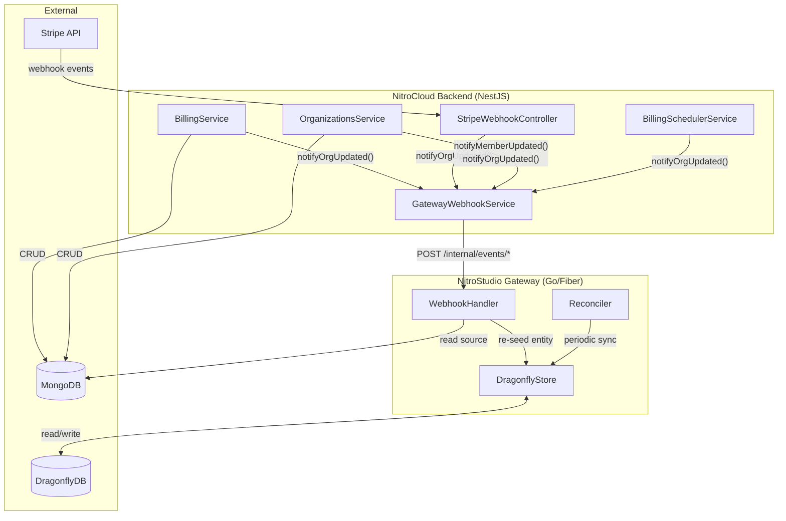
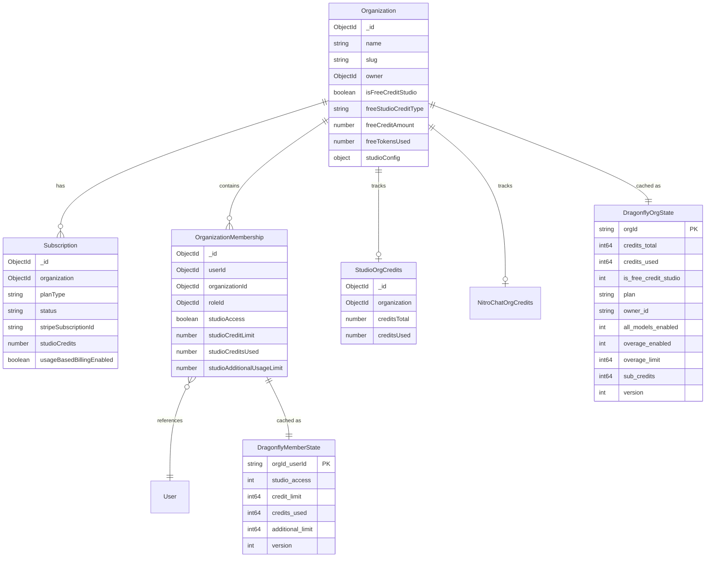
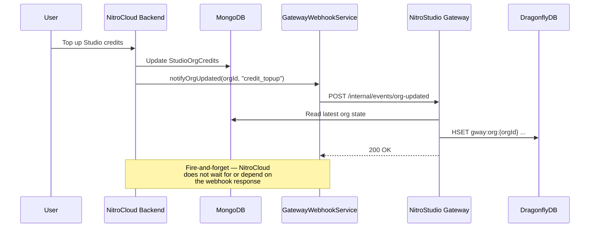

# Gateway Dragonfly Webhook Integration

## Overview

NitroStudio Gateway uses **DragonflyDB** (Redis-compatible) as a hot-path cache for organization credits, member access control, and rate limiting. When the NitroCloud backend mutates billing or membership state in MongoDB, the gateway's Dragonfly cache must be notified so it can re-seed immediately — instead of waiting for the periodic reconciliation cycle (every 5 minutes).

This document explains the webhook integration that keeps the two systems in sync.

---

## Why Webhooks?

Without webhooks, the gateway relies on two mechanisms to stay in sync:

1. **Full seed on startup** — reads all orgs/members from MongoDB into Dragonfly
2. **Periodic reconciler** — runs every 5 minutes, compares Dragonfly vs MongoDB, fixes drift

Both have latency. A credit topup or member permission change could take up to 5 minutes to reflect in the gateway's hot path. Webhooks solve this by triggering an **immediate re-seed of the specific entity** that changed.

---

## Architecture



---

## Entity Relationship



---

## Gateway Webhook Endpoints

All endpoints are under `/internal/` and require `Authorization: Bearer {INTERNAL_WEBHOOK_SECRET}`:

| Endpoint | Method | Payload | Purpose |
|----------|--------|---------|---------|
| `/internal/events/org-updated` | POST | `{ orgId, event }` | Re-seed org state from MongoDB into Dragonfly |
| `/internal/events/member-updated` | POST | `{ orgId, userId, event }` | Re-seed member state from MongoDB into Dragonfly |
| `/internal/events/period-reset` | POST | `{ orgId }` | Reset org's period counters in Dragonfly |
| `/internal/reconcile` | POST | `{}` | Trigger full Dragonfly ↔ MongoDB reconciliation |

---

## Entry Points (Where Webhooks Are Called)

### BillingService (`src/billing/billing.service.ts`)

| Method | Event | Webhook |
|--------|-------|---------|
| `createSubscription()` | `subscription_created` | `notifyOrgUpdated` |
| `updateSubscriptionPlan()` | `plan_changed` | `notifyOrgUpdated` |
| `toggleUsageBasedBilling()` | `usage_billing_toggled` | `notifyOrgUpdated` |
| `cancelSubscription()` | `subscription_canceled` | `notifyOrgUpdated` |
| `topupStudioCredits()` | `credit_topup` | `notifyOrgUpdated` |
| `topupNitroChatCredits()` | `credit_topup` | `notifyOrgUpdated` |

---

### StripeWebhookController (`src/billing/stripe-webhook.controller.ts`)

| Handler | Event | Webhook |
|---------|-------|---------|
| `handleInvoicePaid()` | `invoice_paid` | `notifyOrgUpdated` |
| `handleSubscriptionUpdated()` | `subscription_updated` | `notifyOrgUpdated` |
| `handleSubscriptionDeleted()` | `subscription_deleted` | `notifyOrgUpdated` |
| `handlePaymentIntentSucceeded()` — async topup | `credit_topup` | `notifyOrgUpdated` |
| `handlePaymentIntentSucceeded()` — safety net | `credit_topup` | `notifyOrgUpdated` |
| `handleChargeRefunded()` | `credit_refund` | `notifyOrgUpdated` |

---

### OrganizationsService (`src/organizations/organizations.service.ts`)

| Method | Event | Webhook |
|--------|-------|---------|
| `create()` | `org_created` | `notifyOrgUpdated` |
| `addMember()` | `member_added` | `notifyMemberUpdated` |
| `addMemberViaInvitation()` | `member_added` | `notifyMemberUpdated` |
| `removeMember()` | `member_removed` | `notifyMemberUpdated` |
| `updateMemberStudioAccess()` | `member_updated` | `notifyMemberUpdated` |
| `updateMemberStudioSettings()` | `member_updated` | `notifyMemberUpdated` |
| `updateStudioConfig()` | `studio_config_updated` | `notifyOrgUpdated` |

---

### BillingSchedulerService (`src/billing/services/billing-scheduler.service.ts`)

| Method | Event | Webhook |
|--------|-------|---------|
| `retryPendingQuotaRestores()` | `quota_restored` | `notifyOrgUpdated` |

---

## Data Flow



---

## Configuration

### NitroCloud Backend (`.env`)

```env
# URL of the NitroStudio Gateway (no trailing slash)
GATEWAY_WEBHOOK_URL=http://localhost:8080

# Shared secret — must match the gateway's INTERNAL_WEBHOOK_SECRET
INTERNAL_WEBHOOK_SECRET=your-shared-secret-here
```

### NitroStudio Gateway (`.env`)

```env
DRAGONFLY_ENABLED=true
DRAGONFLY_ADDR=your-dragonfly-host:6379
DRAGONFLY_PASSWORD=your-password

# Must match NitroCloud's INTERNAL_WEBHOOK_SECRET
INTERNAL_WEBHOOK_SECRET=your-shared-secret-here
```

---

## File Reference

| File | Role |
|------|------|
| `src/billing/services/gateway-webhook.service.ts` | **NEW** — HTTP client for gateway webhooks |
| `src/billing/billing.module.ts` | Registers `GatewayWebhookService` |
| `src/organizations/organizations.module.ts` | Registers `GatewayWebhookService` |
| `src/billing/billing.service.ts` | Calls `notifyOrgUpdated` on subscription/credit changes |
| `src/billing/stripe-webhook.controller.ts` | Calls `notifyOrgUpdated` on Stripe webhook events |
| `src/organizations/organizations.service.ts` | Calls `notifyOrgUpdated` / `notifyMemberUpdated` on member changes |
| `src/billing/services/billing-scheduler.service.ts` | Calls `notifyOrgUpdated` after quota restore |

---

## Failure Handling

All webhook calls are **fire-and-forget**:

- Errors are logged with `Logger.warn()`, never thrown
- A 5-second `AbortSignal.timeout` prevents hung connections
- If the gateway is unreachable, the periodic reconciler (every 5 min) will eventually fix any drift
- No retry logic — the reconciler acts as the ultimate consistency backstop
